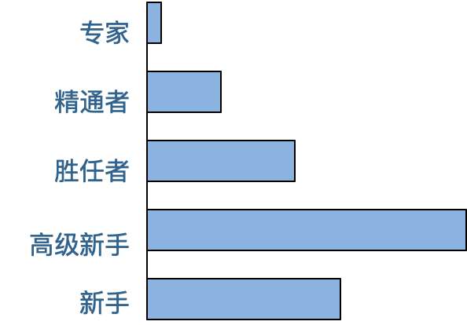

[toc]

## 34 | 技术修炼之道：同样工作十几年，为什么有的人成为大厂架构师，有的人失业？

1.  一个人的技术能力和工作年限并不是正相关的。
2.  那么，如何保持技术能力持续进步，使工作年限成为自己的优势而不是缺点呢？

### 德雷福斯模型

1.  任何专业技能的从业者都需要经历**新手、高级新手、胜任者、精通者、专家** 5 个阶段。
    -   
    -   **新手阶段**，无法独立完成工作。
    -   **高级新手阶段**，新手的自然延续，不需要别人指导工作。
        -   **各专业领域中，超过半数人终其一生都会停留在高级新手阶段**。
        -   重要原因：**高级新手不知道自己是高级新手**。
    -   **胜任者阶段**，**做事具有主动性**。
        -   局限于解决问题本身，而缺乏反思精神及全局思维。
    -   **精通者阶段**，拥有反思精神和全局思维。
        -   需要通过**主动学习**进行提升，**主动进行大量的阅读和培训**。
        -   **拥有了自我改进的能力**。
        -   工作中最重要的不是规则，而是**对场景的理解**。
    -   **专家阶段**
        -   把过往的经验融汇贯通，形成一种**直觉**。然后，用**最直接、最简单的方法把问题解决**。

### 如何在工作中成长

#### 1. 勇于承担责任

-   只有你对结果负责的时候，在压力之下，你才会看透事物本质，抓住技术的核心和关键，能能够让你去学好技术，用好技术，在团队中承担核心的技术职责和产生自己的技术影响，并巩固自己的技术地位。

#### 2. 在实践中保持技能

-   一万小时定律。
-   不断超越自我，挑战自我的工作。

#### 3. 关注问题场景

-   所谓的专家，其实是关于**根据问题场景发现解决方法**的那个人。
-   工作中，真正复杂的是问题的场景，是如何真正地理解问题。

### 小结

1.  如果你是一个新手，你要去思考规则背后的原理，主动发现新问题然后去解决问题。
2.  如果你是一个多年的资深工程师。你该去思考，如何超越当前阶段，成为一个专家？

