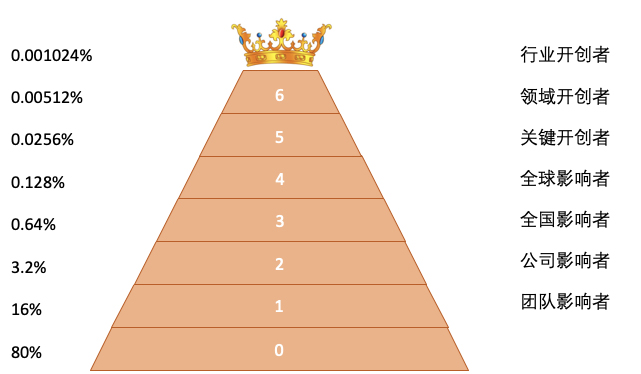

[toc]

## 35 | 技术进阶之道：你和这个星球最顶级的程序员差几个等级？

### 软件技术的生态江湖与等级体系

1.  我们按照每个人的影响力和技能水平，使用二八定律进行划分，得到一个如下金字塔结构：
    -   
2.  基本上，你能超越你当前所在层次 80% 的人，你就可以进入更上一个层级。

### 技术进阶之捷径

1.  直接去做一个**全国影响者**。
    -   在某个技术领域打造自己的技术影响力：技术博客、技术公众号、技术主题演讲、出版一些高质量的图书。
    -   一方面要，**持续努力**，另一方面，还要有**眼当**。
2.  如果你足够努力并有足够的天分，你甚至可以超越影响者阶层，直接进入**开创者阶层**。

### 小结

1.  工作中，技术实力困然重要，但**技术影响力**非常重要。
2.  如何构建自己的技术影响力，有两点建议：
    -   **承担责任**
    -   **帮助他人**
3.  技术影响力的前提是**真正的技术实力**，没有实力的影响力就是空中楼阁，不堪一击。