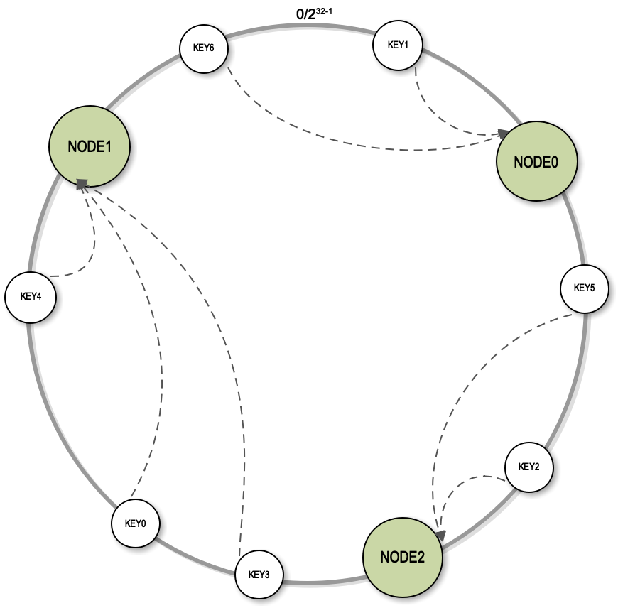
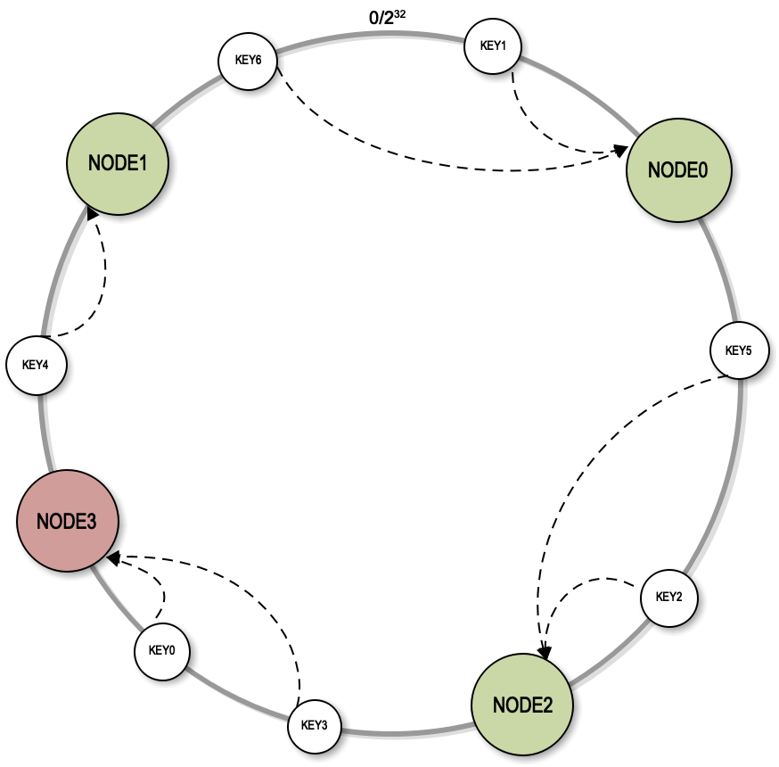

[toc]

## 答疑 | 互联网需要解决的技术问题是什么？

### 专栏 22 篇，分布式缓存架构的思考题

>   Memcached 路由算法讲到余数 Hash 算法。这种算法在服务器集群扩容，也就是增加服务器的时候，会遇到较大的问题，问题是什么呢？应该如何解决呢？

1.  解决这个问题的主要手段是使用**一致性 Hash 算法**。

    -   一致性 Hash 首先是构建一个一致性 Hash 环的结构。
    -   然后我们将每个服务器的节点的 Hash 值放到环上，每一次进行服务器查找路由计算的时候，都是根据 Key 的 Hash 值顺时针查找距离它最近的服务器的节点。
    -   

    -   扩容时，只需要将新节点的 Hash 值放到来环上。
    -   
    -   一致性 Hash 算法有一个致命的**缺陷**。**Hash 值是一个随机值，把一个随机值放到一个环上后，可能是不均衡的**。

2.  虚拟节点算法

    >   也就是说当把一个服务器节点放入到一致性 Hash 环上的时候，并不是把真实的服务器的 Hash 值放到环上，而是将一个服务器节点虚拟成若干个虚拟节点，把这些虚拟节点的 Hash 值放到环上去。在实践中通常是把一个服务器节点虚拟成 200 个虚拟节点，然后把 200 个虚拟节点放到环上。Key 依然是顺时针的查找距离它最近的虚拟节点，找到虚拟节点以后，根据映射关系找到真正的物理节点。

    -   使用虚拟节点的方式，**物理节点之间的负载压力相对比较均衡**。
    -   既保证大部分缓存能够命中，保持缓存服务的有效性，又分摊了所有缓存服务器的负载压力，达到了集群处理能力动态伸缩的目的。

### 专栏 25 篇，数据存储架构思考题

### 专栏 21 篇，分布式架构的思考题

>   互联网系统和传统 IT 系统面对的挑战，除了高并发，还有哪些不同？

1.  问题解析：**互联网需要解决的技术问题是什么？解决方案是什么？带来的价值是什么**？
    -   **高并发**
    -   **高可用**，参考 [29-高可用架构]
    -   **大数据存储**，参考 [25-数据存储架构]
    -   **快速查找**，参考 [26-搜索引擎架构]
    -   **数据挖掘**，参考 [31-大数据架构]
    -   **安全性**，参考 [30-安全性架构]
    -   **软件设计**，参考 [模块二，软件的设计原理]
    -   **架构**，参考 [23-异步架构]、[27-微服务架构]

### 小结

1.  以分布式技术为代表的互联网技术也必然重构软件开发与架构设计的技术模式。

