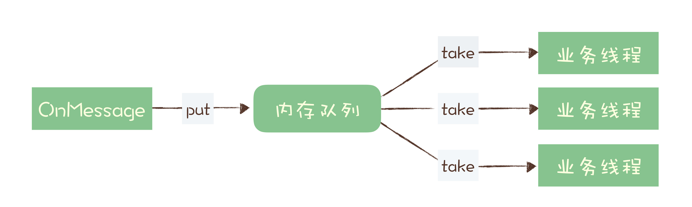

[toc]

## 07 | 消息积压了该如何处理？

1.  今天，我们分析如下两个问题
    -   如何优化代码的性能，**避免出现消息积压**。
    -   线上出现消息积压，**该如何进行紧急处理**。

### 优化性能来避免消息积压

1.  性能优化主要体现在**生产者和消费者**两部分业务中，消息队列本身性能，不需要太关注。
    -   **消息的收发两端，我们的业务代码怎么和消息队列配合，达到一个最佳的性能**。

#### 1. 发送端性能优化

1.  **优先检查**下，是不是**发消息前的业务逻辑耗时太多**导致的。
2.  性能优化
    -   **增加并发**
    -   **增加每次发送的批量大小**
3.  场景：
    -   **在线业务**，较在意**请求响应时延**，通过**并发**来提升发送性能。
    -   **离线分析系统**，注重整个系统的**吞吐量**，更适合**批量发送**。

#### 2. 消费端性能优化

1.  设计时，一定要保证**消费端的消费性能要高于生产端的发送性能**，这样的系统才能健康持续运行。

2.  性能优化

    -   优化消费逻辑

    -   水平扩容

        >   注意：
        >
        >   ​	在扩容 Consumer 的实例数量的同时，必须同步扩容主题中分区（队列）的数量，**确保 Consumer 的实例数和分区数量是相等的**。
        >
        >   
        >
        >   ​	因为，每个分区实际上只能支持单线程消费。

3.  优化反例

    -   
    -   如果收消息节点宕机，在内存队列还来及处理的这些**消息就会丢失**，

### 消息积压了该如何处理？

1.  最粗粒度的原因
    -   发送变快了
    -   消费变慢了
2.  性能优化
    -   扩容消费端的实例数
    -   系统降级
3.  一种不太常见的情况
    -   是不是消费失败，导致一条消息反复消费。

### 小结

1.  两个问题
    -   如何在消费队列的收发两端优化系统性能，提前预防
    -   当系统发生消息积压后，该如何处理。
2.  预防积压的方法
    -   **增加批量**
    -   **增加并发**
        -   在消费端，增加并发需要同步扩容分区数量。
3.  对于系统发生积压，需要先解决积压，再分析原因。
    -   快速解决方法，通过**水平扩容**增加 Consumer 的实例数量。

