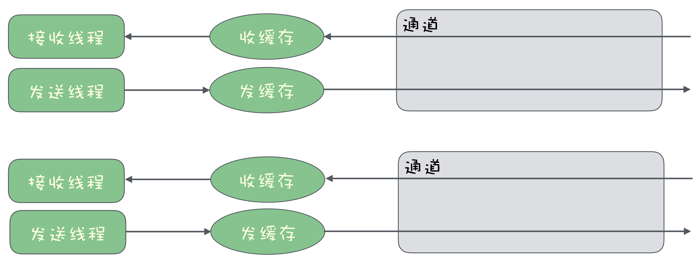
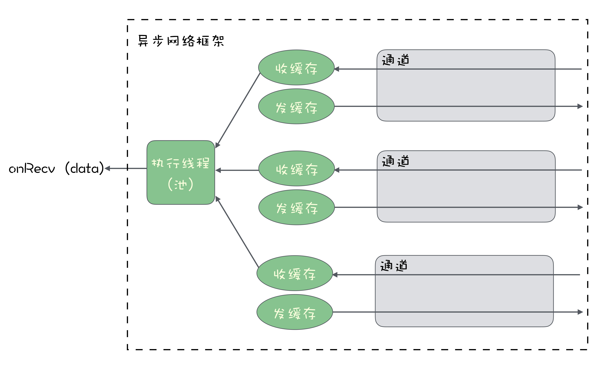
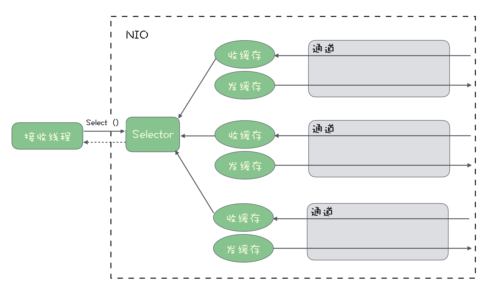

[toc]

## 11 | 如何实现高性能的异步网络传输？

1.  常用的 IO 资源：
    -   磁盘 IO，SSD。 
    -   网络 IO
2.  **如何来实现高性能的异步网络传输**？

### 理想的异步网络框架应该是怎么样的？

1.  如果发送数据的速度没有超过网卡传输的速度上限，那这个发送数据的操作耗时，只不过是一次内存写入的时候，这会非常快。这时，**发送数据时同步发送就可以了，没有必要异步**。
    -   
2.  如果同时处理非常多的连接，同步网络 IO 就有点力不从心了。
3.  一个**好的异步网络框架**，它的 API 应该是怎么样的呢？
    -   只用**少量的线程就能处理大量的连接**，有数据到来的时候，能第一时间处理就可以了。
    -   
4.  最简单的方式
    -   事先定义好收到数据后的处理逻辑，把这个处理逻辑作为一个回调方法，在连接建立前就通过框架提供的 API 设置好。
    -   当收到数据的时候，由框架自动来执行这个回调方法就好了。

### 使用 Netty 来实现异步网络通信

1.  使用 Netty 实现异步接收数据。

    -   ```java
        
        // 创建一组线性
        EventLoopGroup group = new NioEventLoopGroup();
        
        try{
            // 初始化Server
            ServerBootstrap serverBootstrap = new ServerBootstrap();
            serverBootstrap.group(group);
            serverBootstrap.channel(NioServerSocketChannel.class);
            serverBootstrap.localAddress(new InetSocketAddress("localhost", 9999));
        
            // 设置收到数据后的处理的Handler
            serverBootstrap.childHandler(new ChannelInitializer<SocketChannel>() {
                protected void initChannel(SocketChannel socketChannel) throws Exception {
                    socketChannel.pipeline().addLast(new MyHandler());
                }
            });
            // 绑定端口，开始提供服务
            ChannelFuture channelFuture = serverBootstrap.bind().sync();
            channelFuture.channel().closeFuture().sync();
        } catch(Exception e){
            e.printStackTrace();
        } finally {
            group.shutdownGracefully().sync();
        }
        ```

2.  真正需要业务代码来实现的就两部分：

    -   把服务初始化并启动起来。
    -   实现收发消息的业务逻辑 MyHandler。

### 使用 NIO 来实现异步网络通信

1.  在 Java 的 NIO 中，它提供了一个 Selector 对象，来解决**一个线程在多个网络连接上的多路复用问题**。
    -   在 NIO 中，每个已经建立好的连接用一个 Channel 对象来表示。
    -   我们希望实现，在一个线程里，接收来自多个 Channel 的数据。
    -   
2.  Selector 通过一种类似于事件的机制来解决这个问题。
    -   首先，你把你的连接，也就是 Channel 绑定到 Selector 上。
    -   然后，你可以在接收数据的线程来调用 Selector.select() 方法来等待数据到来。

### 小结

1.  同步网络 IO，一般采用一个线程对应一个 Channel 接收数据，很难支持高并发。
2.  **Netty** 自动地解决了线程控制、缓存管理、连接管理这些问题，用户只需要实现对应的 Handler 来处理收到的数据即可。
3.  **NIO** 是更加底层的 API，它提供了 Selector 机制，用单个线程同时管理多个连接，解决了多路复用这个异步网络通信的核心问题。

