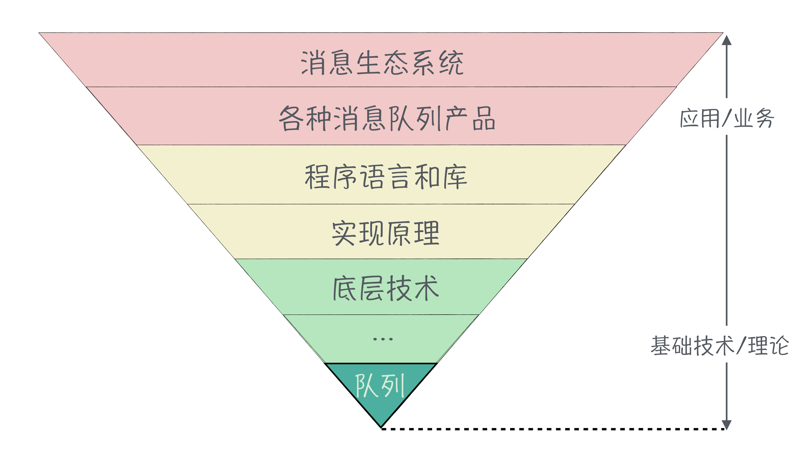

[toc]

## 结束语 | 程序员如何构建知识体系？

1.  技术体系
    -   **越靠上越偏重于应用，或者说偏重于业务。越靠下，越偏重于基础技术和理论**。
    -   
    -   锥形越往下层，涉及到的技术就越少。
    -   **近二十几年，基础理论方面几乎没有任何突破性的进展**。
    -   成体系的技术栈，应该是“**基础深厚，涉猎广泛，融汇贯通**。”
    -   技术体系，自上而下，最好不要有断层，不要浮于表面，**要深入到与你掌握的的底层技术连通起来**。

2.  怎么构建自己的技术知识体系
    -   首先，**在一个技术领域内尽量扩展你的技术广度**。
    -   其次，去深入，有目的的去找领域内最核心的几个技术，去**深入地学习它的实现原理和底层技术**。

3.  小结
    -   “**大道至简，知易行难**”
    -   **沉下心，坚持学习、练习和试错**。