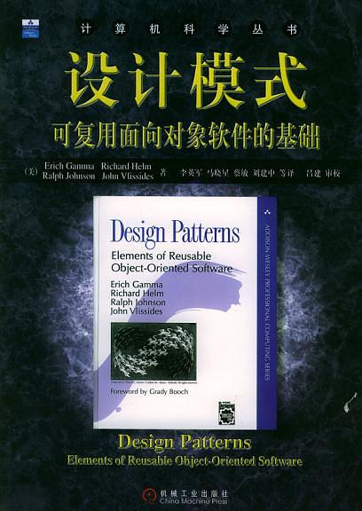
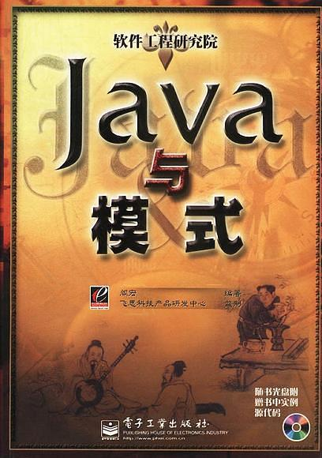
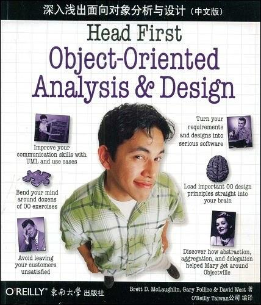
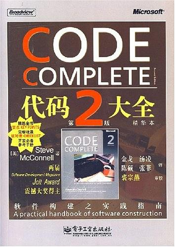
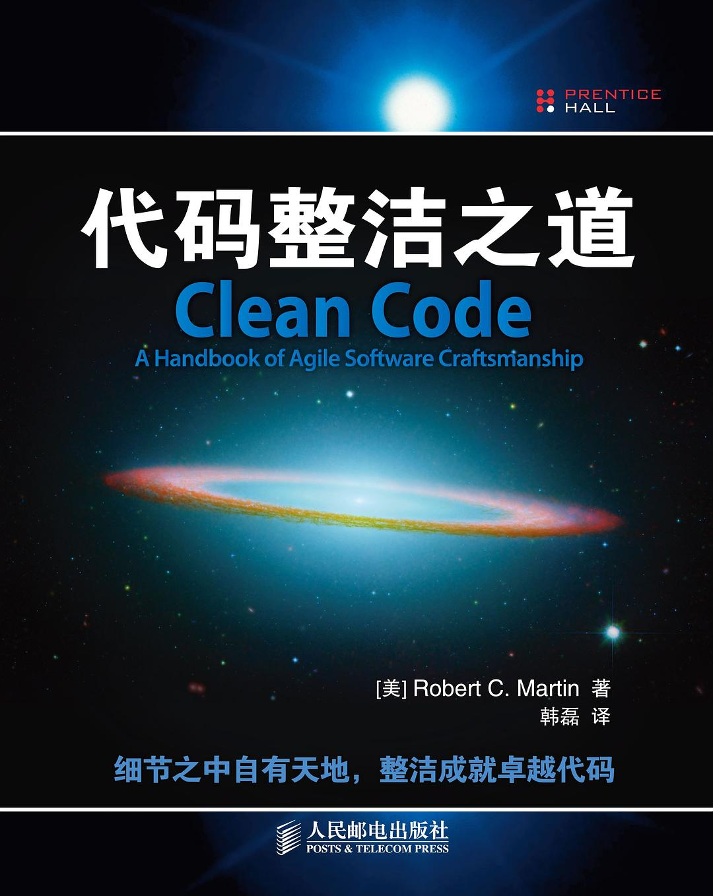
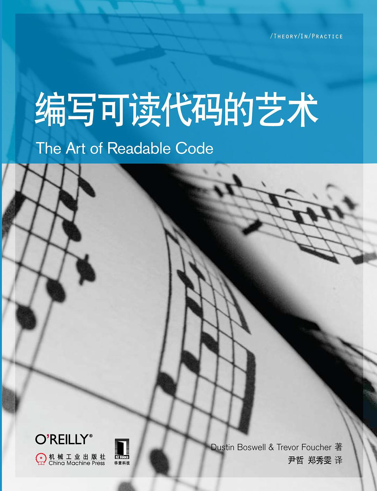
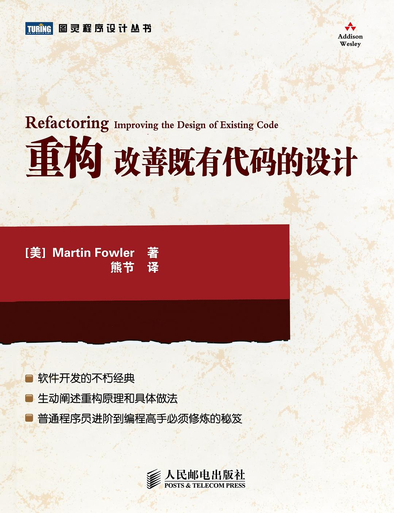
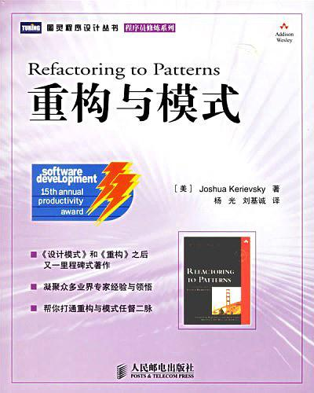
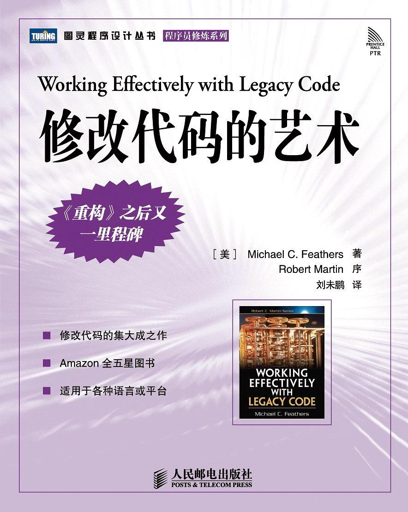

[toc]

## 00 | 加餐二：设计模式、重构、编程规范等相关书籍推荐

### 1. 《设计模式》

-   
-   最经典的设计模式书籍。

### 2. 《Head First 设计模式》

-   
-   最通俗易懂的。

### 3. 《Java 与模式》

-   
-   最贴近实战的一本设计模式书籍。

### 4. 《深入浅出面向对象分析与设计》

-   
-   主要讲的是面向对象分析和设计。

### 5. 《代码大全》

-   
-   本书更像是软件开发方面的工具类的百科全书。

### 6. 《代码整洁之道》

-   
-   内容比较侧重编码规范，每个知识点都非常明确，能够很容易落地指导你的开发，能够立竿见影地改善你的代码质量。

### 7. 《编写可读代码的艺术》

-   
-   本书主要是教你如何写出可读性好的代码，实际上也是讲比较偏向细节的编程规范。

### 8. 《重构》

-   
-   本书的内容总结得非常全面，很适合帮你去做一个整体、系统的梳理。
-   讲如何做低层次的重构。

### 9. 《重构与模式》

-   
-   本书主要讲如何应用设计模式来重构代码，改善代码设计。
-   讲的就是如何做高层次的重构。

### 10.《修改代码的艺术》

-   
-   本书可以粗鲁地归为从面向对象设计思想、设计原则上来讲重构。

