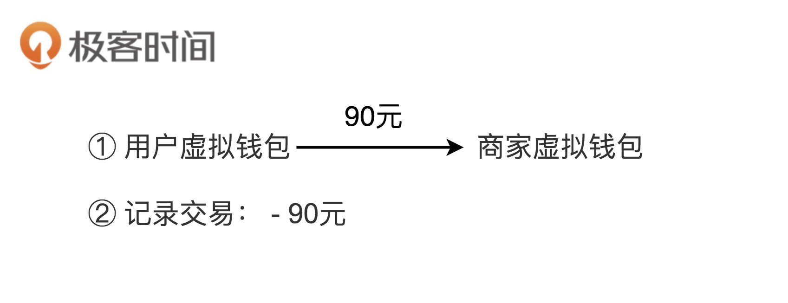
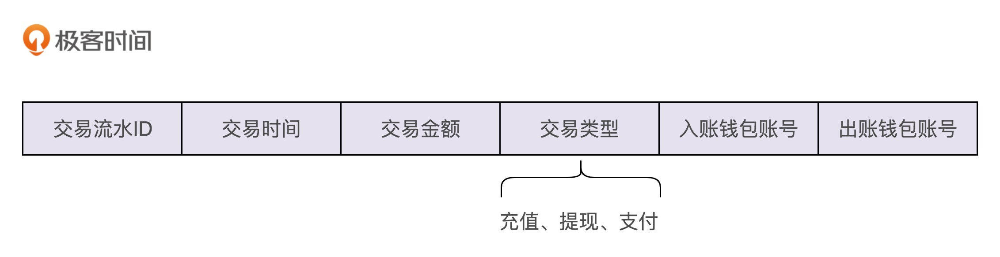

[toc]

## 12 | 实战一（下）： 如何利用基于充血模型的 DDD 开发一个虚拟钱包系统？

### 钱包业务背景介绍

1. 功能界面
	- 
1. 充值
	- 

3. 支付
	- 

4. 提现
	- 

5. 查询余额
6. 查询交易流水

### 设计思路

1. 五个核心功能
	- 
2. 核心功能 <-> 虚拟钱包的操作
	- 
3. 交易流水包含的字段信息
	- 

### 基于贫血模型的传统开发模式

1. Controller

	- ```java
		
		public class VirtualWalletController {
		  // 通过构造函数或者IOC框架注入
		  private VirtualWalletService virtualWalletService;
		  
		  public BigDecimal getBalance(Long walletId) { ... } //查询余额
		  public void debit(Long walletId, BigDecimal amount) { ... } //出账
		  public void credit(Long walletId, BigDecimal amount) { ... } //入账
		  public void transfer(Long fromWalletId, Long toWalletId, BigDecimal amount) { ...} //转账
		  //省略查询transaction的接口
		}
		```

2. Service

	- ```java
		
		public class VirtualWalletBo {//省略getter/setter/constructor方法
		  private Long id;
		  private Long createTime;
		  private BigDecimal balance;
		}
		
		public Enum TransactionType {
		  DEBIT,
		  CREDIT,
		  TRANSFER;
		}
		
		public class VirtualWalletService {
		  // 通过构造函数或者IOC框架注入
		  private VirtualWalletRepository walletRepo;
		  private VirtualWalletTransactionRepository transactionRepo;
		  
		  public VirtualWalletBo getVirtualWallet(Long walletId) {
		    VirtualWalletEntity walletEntity = walletRepo.getWalletEntity(walletId);
		    VirtualWalletBo walletBo = convert(walletEntity);
		    return walletBo;
		  }
		  
		  public BigDecimal getBalance(Long walletId) {
		    return walletRepo.getBalance(walletId);
		  }
		
		  @Transactional
		  public void debit(Long walletId, BigDecimal amount) {
		    VirtualWalletEntity walletEntity = walletRepo.getWalletEntity(walletId);
		    BigDecimal balance = walletEntity.getBalance();
		    if (balance.compareTo(amount) < 0) {
		      throw new NoSufficientBalanceException(...);
		    }
		    VirtualWalletTransactionEntity transactionEntity = new VirtualWalletTransactionEntity();
		    transactionEntity.setAmount(amount);
		    transactionEntity.setCreateTime(System.currentTimeMillis());
		    transactionEntity.setType(TransactionType.DEBIT);
		    transactionEntity.setFromWalletId(walletId);
		    transactionRepo.saveTransaction(transactionEntity);
		    walletRepo.updateBalance(walletId, balance.subtract(amount));
		  }
		
		  @Transactional
		  public void credit(Long walletId, BigDecimal amount) {
		    VirtualWalletTransactionEntity transactionEntity = new VirtualWalletTransactionEntity();
		    transactionEntity.setAmount(amount);
		    transactionEntity.setCreateTime(System.currentTimeMillis());
		    transactionEntity.setType(TransactionType.CREDIT);
		    transactionEntity.setFromWalletId(walletId);
		    transactionRepo.saveTransaction(transactionEntity);
		    VirtualWalletEntity walletEntity = walletRepo.getWalletEntity(walletId);
		    BigDecimal balance = walletEntity.getBalance();
		    walletRepo.updateBalance(walletId, balance.add(amount));
		  }
		
		  @Transactional
		  public void transfer(Long fromWalletId, Long toWalletId, BigDecimal amount) {
		    VirtualWalletTransactionEntity transactionEntity = new VirtualWalletTransactionEntity();
		    transactionEntity.setAmount(amount);
		    transactionEntity.setCreateTime(System.currentTimeMillis());
		    transactionEntity.setType(TransactionType.TRANSFER);
		    transactionEntity.setFromWalletId(fromWalletId);
		    transactionEntity.setToWalletId(toWalletId);
		    transactionRepo.saveTransaction(transactionEntity);
		    debit(fromWalletId, amount);
		    credit(toWalletId, amount);
		  }
		}
		```

	- 

### 基于充血模型的 DDD 开发模式

1. Service

	- ```java
		
		public class VirtualWallet { // Domain领域模型(充血模型)
		  private Long id;
		  private Long createTime = System.currentTimeMillis();;
		  private BigDecimal balance = BigDecimal.ZERO;
		  
		  public VirtualWallet(Long preAllocatedId) {
		    this.id = preAllocatedId;
		  }
		  
		  public BigDecimal balance() {
		    return this.balance;
		  }
		  
		  public void debit(BigDecimal amount) {
		    if (this.balance.compareTo(amount) < 0) {
		      throw new InsufficientBalanceException(...);
		    }
		    this.balance = this.balance.subtract(amount);
		  }
		  
		  public void credit(BigDecimal amount) {
		    if (amount.compareTo(BigDecimal.ZERO) < 0) {
		      throw new InvalidAmountException(...);
		    }
		    this.balance = this.balance.add(amount);
		  }
		}
		
		public class VirtualWalletService {
		  // 通过构造函数或者IOC框架注入
		  private VirtualWalletRepository walletRepo;
		  private VirtualWalletTransactionRepository transactionRepo;
		  
		  public VirtualWallet getVirtualWallet(Long walletId) {
		    VirtualWalletEntity walletEntity = walletRepo.getWalletEntity(walletId);
		    VirtualWallet wallet = convert(walletEntity);
		    return wallet;
		  }
		  
		  public BigDecimal getBalance(Long walletId) {
		    return walletRepo.getBalance(walletId);
		  }
		  
		  @Transactional
		  public void debit(Long walletId, BigDecimal amount) {
		    VirtualWalletEntity walletEntity = walletRepo.getWalletEntity(walletId);
		    VirtualWallet wallet = convert(walletEntity);
		    wallet.debit(amount);
		    VirtualWalletTransactionEntity transactionEntity = new VirtualWalletTransactionEntity();
		    transactionEntity.setAmount(amount);
		    transactionEntity.setCreateTime(System.currentTimeMillis());
		    transactionEntity.setType(TransactionType.DEBIT);
		    transactionEntity.setFromWalletId(walletId);
		    transactionRepo.saveTransaction(transactionEntity);
		    walletRepo.updateBalance(walletId, wallet.balance());
		  }
		  
		  @Transactional
		  public void credit(Long walletId, BigDecimal amount) {
		    VirtualWalletEntity walletEntity = walletRepo.getWalletEntity(walletId);
		    VirtualWallet wallet = convert(walletEntity);
		    wallet.credit(amount);
		    VirtualWalletTransactionEntity transactionEntity = new VirtualWalletTransactionEntity();
		    transactionEntity.setAmount(amount);
		    transactionEntity.setCreateTime(System.currentTimeMillis());
		    transactionEntity.setType(TransactionType.CREDIT);
		    transactionEntity.setFromWalletId(walletId);
		    transactionRepo.saveTransaction(transactionEntity);
		    walletRepo.updateBalance(walletId, wallet.balance());
		  }
		
		  @Transactional
		  public void transfer(Long fromWalletId, Long toWalletId, BigDecimal amount) {
		    //...跟基于贫血模型的传统开发模式的代码一样...
		  }
		}
		
		```

2. 目前来看，领域模型 VirtualWallet 类很单薄，包含的业务逻辑很简单。不过，如果虚拟钱包系统**需要支持更复杂的业务逻辑**，那充血模型的优势就显现出来了。

	- ```java
		
		public class VirtualWallet {
		  private Long id;
		  private Long createTime = System.currentTimeMillis();;
		  private BigDecimal balance = BigDecimal.ZERO;
		  private boolean isAllowedOverdraft = true;
		  private BigDecimal overdraftAmount = BigDecimal.ZERO;
		  private BigDecimal frozenAmount = BigDecimal.ZERO;
		  
		  public VirtualWallet(Long preAllocatedId) {
		    this.id = preAllocatedId;
		  }
		  
		  public void freeze(BigDecimal amount) { ... }
		  public void unfreeze(BigDecimal amount) { ...}
		  public void increaseOverdraftAmount(BigDecimal amount) { ... }
		  public void decreaseOverdraftAmount(BigDecimal amount) { ... }
		  public void closeOverdraft() { ... }
		  public void openOverdraft() { ... }
		  
		  public BigDecimal balance() {
		    return this.balance;
		  }
		  
		  public BigDecimal getAvaliableBalance() {
		    BigDecimal totalAvaliableBalance = this.balance.subtract(this.frozenAmount);
		    if (isAllowedOverdraft) {
		      totalAvaliableBalance += this.overdraftAmount;
		    }
		    return totalAvaliableBalance;
		  }
		  
		  public void debit(BigDecimal amount) {
		    BigDecimal totalAvaliableBalance = getAvaliableBalance();
		    if (totoalAvaliableBalance.compareTo(amount) < 0) {
		      throw new InsufficientBalanceException(...);
		    }
		    this.balance = this.balance.subtract(amount);
		  }
		  
		  public void credit(BigDecimal amount) {
		    if (amount.compareTo(BigDecimal.ZERO) < 0) {
		      throw new InvalidAmountException(...);
		    }
		    this.balance = this.balance.add(amount);
		  }
		}
		
		```

	- 

### 辩证思考与灵活应用

1. 在基于充血模型的 DDD 开发模式中，将业务逻辑移动到 Domain 中，Service 类变得很薄，但在我们的代码设计与实现中，并没有完全将 Service 类去掉，这是为什么？或者说，**Service 类在这种情况下担当的职责是什么？哪些功能逻辑会放到 Service 类中？**

  - Service 类负责与 Repository 交流。

    > 负责一些不适合放在 Domain 类中的功能。
    >
    > 保持领域模型的独立性，不与任何其他层的代码（Repository 层的代码）或开发框架（比如 Spring、MyBatis）耦合在一起，将流程性的代码逻辑（比如从 DB 中取数据、映射数据）与领域模型的业务逻辑解耦，让领域模型更加可复用。

  - Service 类负责跨领域模型的业务聚合功能。

  - Service 类负责一些非功能性及与三方系统交互的工作。

2. 在基于充血模型的 DDD 开发模式中，尽管 Service 层被改造成了充血模型，但是 Controller 层和 Repository 层还是贫血模型，是否有必要也进行充血领域建模呢？

	- 没有必要，这两层包含的业务逻辑并不多。
	- 尽管这样的设计是一种面向过程的编程风格，但我们只要控制好面向过程编程风格的副作用。

