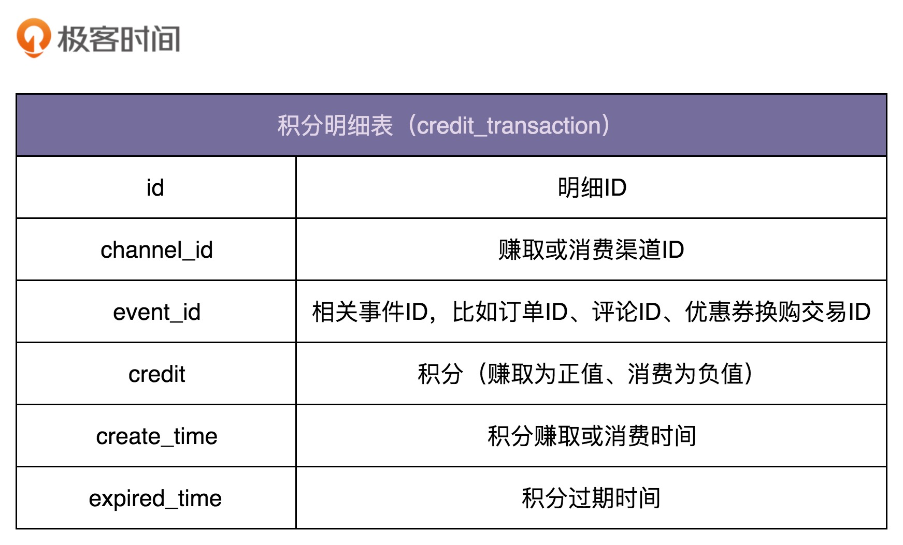
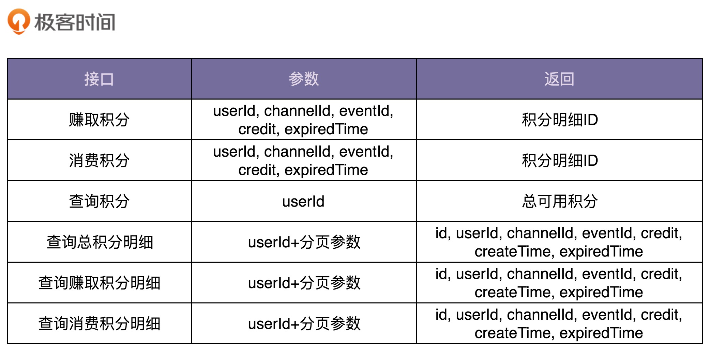
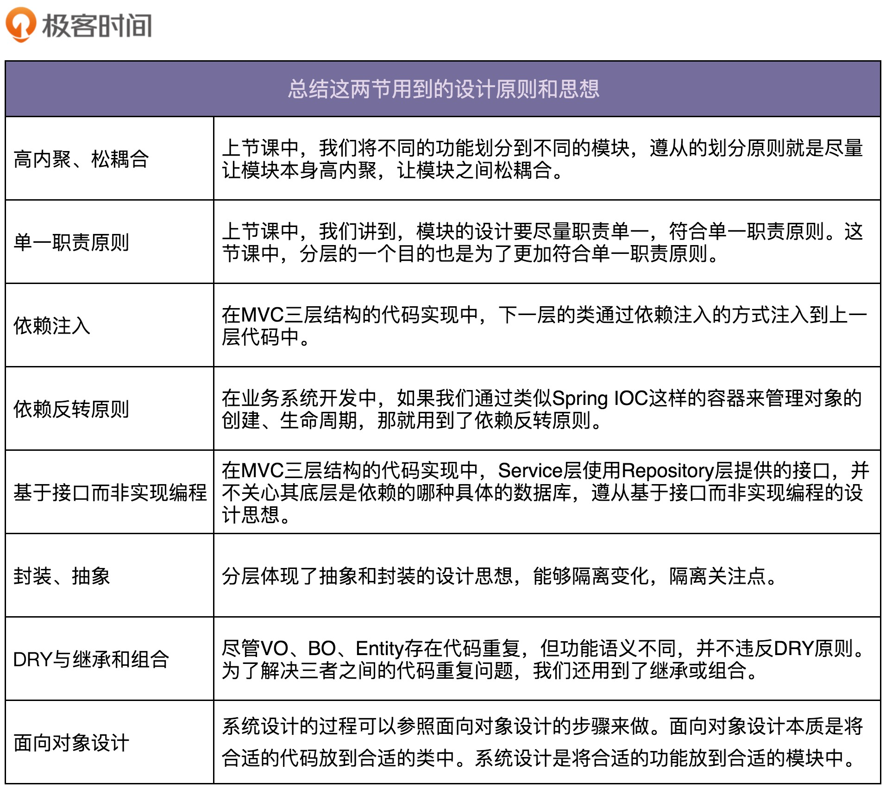

[toc]

## 24 | 实战一（下）：如何实现一个遵从设计原则的积分兑换系统？

-   今天，我们讲解的重点是给你展示一些更普适的开发思想。最后，还会总结这其中都蕴含哪些设计原则和思想，让你知其然知其所以然，做到真正地透彻理解。

### 业务开发包括哪些工作？

-   平时做业务系统的设计与开发，无外乎这样三方面工作要做:
    -   接口设计
    -   数据库设计
    -   业务模型设计（也就是业务逻辑）

#### 如何设计数据库

-   我们只需要一张记录积分流水明细的表。如下
    -   

#### 如何设计积分系统的接口

-   **为了兼顾易用性和性能，我们可以借鉴 facede(外观)设计模式，在职责单一的细粒度接口之上，再封装一层粗粒度的接口给外部使用。**
-   对于积分系统来说，我们需要设计如下这样几个接口：
    -   

#### 我们来看业务模型的设计

-   对于我们要开发的积分系统，因为业务相对比较简单，所以，**选择简单的基于贫血模型的传统开发模式**就足够了。
-   积分系统业务比较简单，代码量也不多，我更倾向于将它跟营销系统放到一个项目中开发部署。只要我们做好代码的模块化和解耦，让积分相关的业务代码跟其他业务代码之间边界清晰，没有太多耦合，后期如果需要拆分，也并不困难。 

### 为什么要分 MVC 三层开发？

#### 1. 分层能起到代码复用的作用

-   同一个 Repository 可能会被多个 Service 来调用，同一个 Service 可能会被多个 Controller 调用。
-   如果没有 Service 层，每个 Controller 都要重复实现这部分逻辑，显然会违反 DRY 原则。

#### 2. 分层能起到隔离变化的作用

-   分层体现了一种抽象和封装的设计思想。
-   除此外，Controller、Service、Repository 三层代码的稳定程度不同，引起变化的原因不同， 所以分成三层来组织代码，能有效地隔离变化。

#### 3. 分层能起到隔离关注点的作用

-   Repository 层只关注数据的读写。Service 层只关注业务逻辑，不关注数据的来源。Controller 层只关注与外界打交道，数据校验、封装、格式转换，并不关心业务逻辑。
-   三层的关注点不同，分层之后，职责分明，更加符合单一职责原则，代码的内聚性更好。

#### 4. 分层能提高代码的可测试性

-   后面单元测试，我们会讲到，单元测试不依赖不可按的外部组件，如数据库。分层后，Repository 层的代码通过依赖注入的方式供 Service 层使用，当要测试包含核心业务逻辑的 Service 层代码的时候，我们可以用 mock 的数据源替代真实的数据库，注入到 Service 层代码中。

#### 5. 分层能应对系统的复杂性

-   当一个函数或一个类的代码过多后，可读性、可维护性就会变差。那我们就要想办法拆分。
-   拆分分垂直和水平两个方向。
    -   水平方向基于业务来做拆分，就是模块化。
    -   垂直方向基于流程来做拆分，就是这里说的分层。

### BO、VO、Entity 存在的意义是什么？

#### 相对于每层定义各自的数据对象来说，是不是定义一个公共的数据对象更好些呢？

-   我更加推荐**每层都定义各自的数据对象这种设计思路**，主要有如下 3 个方面的原因。
    1.  VO、BO、Entity 并非完全一样。
    2.  VO、BO、Entity 三个类虽然代码重复，但功能语义不重复，从职责上讲是不一样的。所以 也并不能算违背 DRY 原则。
    3.  为了尽量减少每层间的耦合，把职责边界划分明确，每层都会维护自己的数据对象，层与层之间通过接口交互。这样，对于非常大的项目来说，结构清晰是第一位。

#### 既然 VO、BO、Entity 不能合并，那如何解决代码重复的问题呢？

1.  继承
2.  组合

#### 代码重复问题解决了，那不同的分层之间的数据对象该如何互相转化呢？

1.  最简单的转化方式就是手动复制。
2.  如 Java 中提供了多种数据对象转化的工具（BeanUtils、Dozer等）
3.  借鉴 Java 这些工具类的设计思路，自己在项目中实现对象转化的工具类。

#### VO、BO、Entity 都是基于贫血模型的，而且为了兼容框架或开发库（如 MyBatis、Dozer、BeanUtils），我们还需要定义每个字段的 set 方法。这些都违背了 OOP 的封装特性，会导致数据被随意修改。那到底该怎么办好呢？

-   **设计的问题本身就没有最优解，只有权衡**。为了使用方便，我们只能做一些妥协，放弃 BO 的封闭特性，由程序员自己来负责这些数据对象的不被错误使用。

### 总结用到的设计原则和思想

-   现在，我就给你罗列一下，今天讲解的内容中，都用到哪些设计原则、思想和模式。
    -   

### 重点回顾

