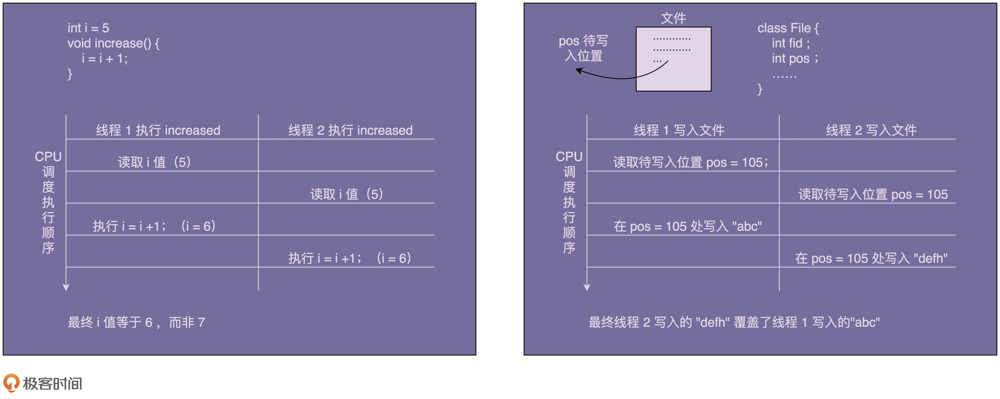
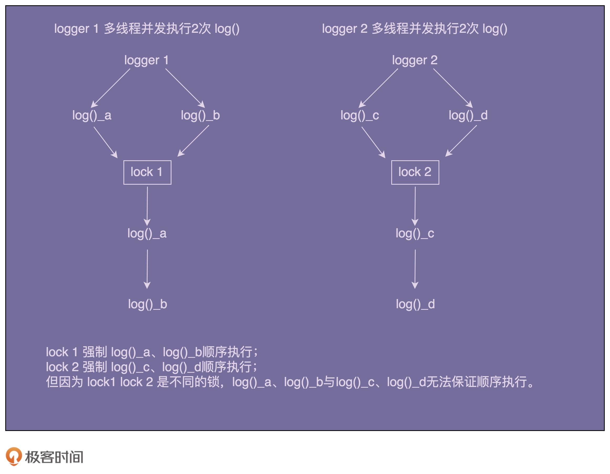

[toc]

## 41 | 单例模式（上）：为什么说懒汉式的双重加载不比饿汉式更优？

-   今天，希望大家重点搞清楚下面这样几个问题：
    1.  为什么要使用单例？
    2.  单例存在哪些问题？
    3.  单例与静态类的区别？
    4.  有何替代的解决方案？

### 为什么要使用单例？

-   单例设计模式：**一个类只允许创建一个对象（或者实例）。**

#### 实战案例一：处理资源访问冲突

-   如下例中，我们自定义实现了一个往文件中打印日志的 Logger 类。代码如下：

    -   ```java
        
        public class Logger {
          private FileWriter writer;
          
          public Logger() {
            File file = new File("/Users/wangzheng/log.txt");
            writer = new FileWriter(file, true); //true表示追加写入
          }
          
          public void log(String message) {
            writer.write(mesasge);
          }
        }
        
        // Logger类的应用示例：
        public class UserController {
          private Logger logger = new Logger();
          
          public void login(String username, String password) {
            // ...省略业务逻辑代码...
            logger.log(username + " logined!");
          }
        }
        
        public class OrderController {
          private Logger logger = new Logger();
          
          public void create(OrderVo order) {
            // ...省略业务逻辑代码...
            logger.log("Created an order: " + order.toString());
          }
        }
        ```

-   思考下如上代码中，存在什么问题？

    -   在多个线程同时分别执行 login() 和 create() 两个函数，并且同时写日志到 log.txt 文件中，那就有可能存在日志信息互相覆盖的情况。

-   为什么会出现互相覆盖呢？

    -   

-   如何来解决这个问题呢？

    -   最先想到的就是通过加锁的方式：给 log() 函数添加互斥锁，同一时刻只允许一个线程调用执行 log() 函数。

    -   ```java
        
        public class Logger {
          private FileWriter writer;
        
          public Logger() {
            File file = new File("/Users/wangzheng/log.txt");
            writer = new FileWriter(file, true); //true表示追加写入
          }
          
          public void log(String message) {
            synchronized(this) {
              writer.write(mesasge);
            }
          }
        }
        ```

    -   思考：这真的能解决多线程写入日志互相覆盖的问题吗？

        -   答案是否定的。
        -   这种锁是一个对象级别的锁，一个对象在不同的线程下同时调用 log() 函数，会被强制要求顺序执行。
        -   但，不同的对象间并不共享同一把锁。在不同的线程下，通过不同的对象调用执行 log() 函数，锁并不会起作用，仍然有可能存在写入日志互相覆盖的问题。
        -   

    -   补充下，这里给 log() 函数加不加对象级别的锁，其实都没关系。因为 FileWriter 本身就是线程安全的，它的内部实现中本身就加了对象级别的锁。

-   我们该怎么解决这个问题吗？

    -   我们只需要把对象级别的锁，换成类级别的锁就可以了。让所有对象都共享同一把锁。这样就避免了不同对象间同时调用 log() 函数，而导致的日志覆盖问题。代码如下：

    -   ```java
        
        public class Logger {
          private FileWriter writer;
        
          public Logger() {
            File file = new File("/Users/wangzheng/log.txt");
            writer = new FileWriter(file, true); //true表示追加写入
          }
          
          public void log(String message) {
            synchronized(Logger.class) { // 类级别的锁
              writer.write(mesasge);
            }
          }
        }
        ```

-   优化：解决资源竞争问题的办法。

    -   使用单例模式，较使用类级别的锁的好处是，不用创建那么多 Logger 对象。

        -   一方面节省内在空间。
        -   另一方面节省系统文件句柄。

    -   ```java
        
        public class Logger {
          private FileWriter writer;
          private static final Logger instance = new Logger();
        
          private Logger() {
            File file = new File("/Users/wangzheng/log.txt");
            writer = new FileWriter(file, true); //true表示追加写入
          }
          
          public static Logger getInstance() {
            return instance;
          }
          
          public void log(String message) {
            writer.write(mesasge);
          }
        }
        
        // Logger类的应用示例：
        public class UserController {
          public void login(String username, String password) {
            // ...省略业务逻辑代码...
            Logger.getInstance().log(username + " logined!");
          }
        }
        
        public class OrderController {
          private Logger logger = new Logger();
          
          public void create(OrderVo order) {
            // ...省略业务逻辑代码...
            Logger.getInstance().log("Created a order: " + order.toString());
          }
        }
        ```

#### 实战案例二：表示全局唯一类

-   从业务上，如果有些数据在系统中只应保存一份，那就比较适合设计为单例类。

    -   如，配置信息类、唯一递增 ID 号码生成器。

    -   ```java
        
        import java.util.concurrent.atomic.AtomicLong;
        public class IdGenerator {
          // AtomicLong是一个Java并发库中提供的一个原子变量类型,
          // 它将一些线程不安全需要加锁的复合操作封装为了线程安全的原子操作，
          // 比如下面会用到的incrementAndGet().
          private AtomicLong id = new AtomicLong(0);
          private static final IdGenerator instance = new IdGenerator();
          private IdGenerator() {}
          public static IdGenerator getInstance() {
            return instance;
          }
          public long getId() { 
            return id.incrementAndGet();
          }
        }
        
        // IdGenerator使用举例
        long id = IdGenerator.getInstance().getId();
        ```

    -   

### 如何实现一个单例？

-   要实现一个单例，我们需要关注如下几点：

    >   构造函数需要 private 访问权限，这样才能避免外部通过 new 创建实现。
    >
    >   考虑对象创建时的线程安全问题。
    >
    >   考虑是否支持延迟加载。
    >
    >   考虑 getInstance() 性能是否高（是否加锁）。

#### 1. 饿汉式

-   在类加载的时候，instance 静态实例就已经创建初始化好了，所以，**instance 实例的创建过程是线程安全的**。

-   不过这样的实现方式不支持延迟加载。

-   代码如下：

    -   ```java
        
        public class IdGenerator { 
          private AtomicLong id = new AtomicLong(0);
          private static final IdGenerator instance = new IdGenerator();
          private IdGenerator() {}
          public static IdGenerator getInstance() {
            return instance;
          }
          public long getId() { 
            return id.incrementAndGet();
          }
        }
        ```

    -   

#### 2. 懒汉式

-   相较于饿汉式，**支持延迟加载**。

-   代码如下：

    -   ```java
        
        public class IdGenerator { 
          private AtomicLong id = new AtomicLong(0);
          private static IdGenerator instance;
          private IdGenerator() {}
          public static synchronized IdGenerator getInstance() {
            if (instance == null) {
              instance = new IdGenerator();
            }
            return instance;
          }
          public long getId() { 
            return id.incrementAndGet();
          }
        }
        ```

    -   getInstance() 这人方法加了一把大锁（synchronzed），导致这个函数的并发度很低。

#### 3. 双重检测

-   双重检测是一种**既支持延迟加载，又支持高并发的单例实现方式**。

-   代码如下：

    -   ```java
        
        public class IdGenerator { 
          private AtomicLong id = new AtomicLong(0);
          private static IdGenerator instance;
          private IdGenerator() {}
          public static IdGenerator getInstance() {
            if (instance == null) {
              synchronized(IdGenerator.class) { // 此处为类级别的锁
                if (instance == null) {
                  instance = new IdGenerator();
                }
              }
            }
            return instance;
          }
          public long getId() { 
            return id.incrementAndGet();
          }
        }
        ```

    -   

#### 4. 静态内部类

-   这是一种比双重检测更加简单的实现方法，利用 Java 的静态内部类。

-   类似饿汉式，但又能做到了延迟加载。

-   代码如下：

    -   ```java
        
        public class IdGenerator { 
          private AtomicLong id = new AtomicLong(0);
          private IdGenerator() {}
        
          private static class SingletonHolder{
            private static final IdGenerator instance = new IdGenerator();
          }
          
          public static IdGenerator getInstance() {
            return SingletonHolder.instance;
          }
         
          public long getId() { 
            return id.incrementAndGet();
          }
        }
        ```

    -   instance 的唯一性、创建过程的线程安全性，都上 JVM 来保证。所以，这种实现方法既保证了线程安全，又能做到延迟加载。

#### 5. 枚举

-   这种实现方式通过 Java 枚举类型本身的特性，保证了实例创建的线程安全性和唯一性。

-   代码如下：

    -   ```java
        
        public enum IdGenerator {
          INSTANCE;
          private AtomicLong id = new AtomicLong(0);
         
          public long getId() { 
            return id.incrementAndGet();
          }
        }
        ```

    -   

### 重点回顾

1.  单例的定义
    -   单例设计模式（Singleton Design Pattern）理解起来非常简单。
    -   **一个类只允许创建一个对象（或者叫实例)。**
2.  单例的用处
    -   从业务概念上，有些数据在系统中只应该保存一份，就比较适合设计为单例类。
    -   此外，我们还可以使用单例解决资源访问冲突的问题。
3.  单例的实现
    -   饿汉式
        -   在类加载的期间，就已经将 instance 静态实例初始化好了，所以，instance 实例的创建是线程安全的。
        -   不过，这样的实现方式不支持延迟加载实例。
    -   懒汉式
        -   懒汉式相对于饿汉式的优势是支持延迟加载。
        -   这种实现方式会导致频繁加锁、释放锁、以及并发度低等问题，频繁的调用会产生性能瓶颈。
    -   双重检测
        -   双重检测实现方式既支持延迟加载、又支持高并发的单例实现方式。
        -   只要 instance 被创建后，再调用 getInstance() 函数都不会进入到加锁逻辑中。
        -   所以，这种实现方式解决了懒汉式并发度低的问题。
    -   静态内部类
        -   利用 Java 的静态内部类来实现单例。
        -   这种实现方式，既支持延迟加载，也支持高并发，实现起来也比双重检测简单。
    -   枚举
        -   最简单的实现方式，基于枚举类型的单例实现。
        -   这种实现方式通过 Java 枚举类型本身的特性，保证了实例创建的线程安全性和实例的唯一性。