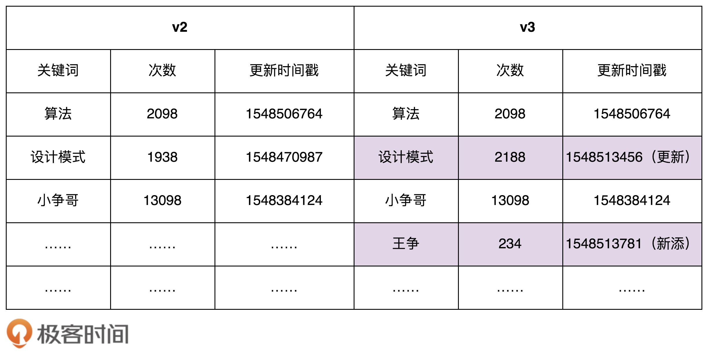
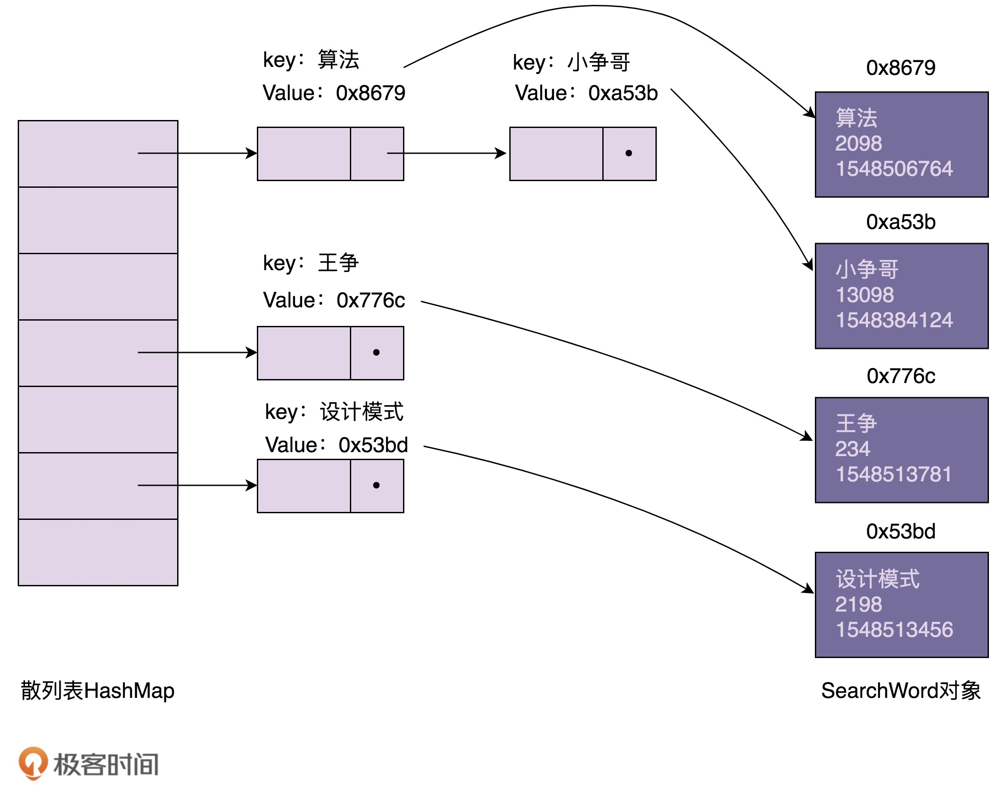
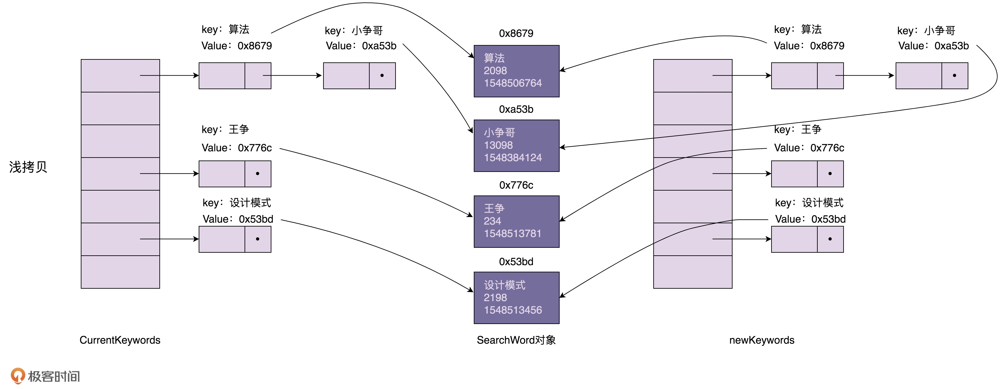

[toc]

## 47 | 原型模式：如何最快速地 clone 一个 HashMap 散列表？

### 原型模式的原理与应用

-   如果对象的创建成本比较大，而同一个类的不同对象之间差别不大（大部分字段都相同），在这种情况下，**我们可以利用对已有的对象（原型）进行复制（或叫拷贝）的方式，来创建对象，**以达到节省创建时间的目的。

-   这种基于原型来创建对象的方式就叫作**原型设计模式**，简称**原型模式**。

-   **何为“对象的创建成本比较大”？**

    -   如果对象中的数据需要经过复杂的计算才得到（如排序、计算哈希值），或需要从 RPC、网络、数据库、文件系统等非常慢速的 IO 中读取，这种情况下，我们就可以利用原型模式，从其他已有的对象中直接拷贝得到，而不是每次在创建新对象的时候，都重复执行这些耗时的操作。

-   **我们通过一个例子来解释一下刚刚这段话。**

    -   假设 DB 中存储了大约 10 万条“搜索关键词”信息。
    -   系统 A 在启动的时候会加载这份数据到内存中。
    -   系统 B 专门用来批量地更新数据库中的数据，并标记为新的数据版本。如下图：
    -   

-   需求 1：为保证系统 A 中的数据的实时性，系统 A 需要**定期**根据数据库中的数据，更新内存数据。

    -   ```java
        
        public class Demo {
          private ConcurrentHashMap<String, SearchWord> currentKeywords = new ConcurrentHashMap<>();
          private long lastUpdateTime = -1;
        
          public void refresh() {
            // 从数据库中取出更新时间>lastUpdateTime的数据，放入到currentKeywords中
            List<SearchWord> toBeUpdatedSearchWords = getSearchWords(lastUpdateTime);
            long maxNewUpdatedTime = lastUpdateTime;
            for (SearchWord searchWord : toBeUpdatedSearchWords) {
              if (searchWord.getLastUpdateTime() > maxNewUpdatedTime) {
                maxNewUpdatedTime = searchWord.getLastUpdateTime();
              }
              if (currentKeywords.containsKey(searchWord.getKeyword())) {
                currentKeywords.replace(searchWord.getKeyword(), searchWord);
              } else {
                currentKeywords.put(searchWord.getKeyword(), searchWord);
              }
            }
        
            lastUpdateTime = maxNewUpdatedTime;
          }
        
          private List<SearchWord> getSearchWords(long lastUpdateTime) {
            // TODO: 从数据库中取出更新时间>lastUpdateTime的数据
            return null;
          }
        }
        ```

-   需求 2：任何时刻，系统 A 中的所有数据必须是同一版本的，要么都是版本 a，要么都是版本 b。此外，在更新内存数据时，系统 A 不能处于不可用状态，也就是不能停机更新数据。

    -   我们在更新数据时候，并不直接在服务版本上更新，而是**创建另一个版本数据**，等新版本数据建好后，再一次性将当前服务版本切换到新版本上。这样既保证了数据一直可用，又避免了中间状态的存在。

    -   ```java
        
        public class Demo {
          private HashMap<String, SearchWord> currentKeywords=new HashMap<>();
        
          public void refresh() {
            HashMap<String, SearchWord> newKeywords = new LinkedHashMap<>();
        
            // 从数据库中取出所有的数据，放入到newKeywords中
            List<SearchWord> toBeUpdatedSearchWords = getSearchWords();
            for (SearchWord searchWord : toBeUpdatedSearchWords) {
              newKeywords.put(searchWord.getKeyword(), searchWord);
            }
        
            currentKeywords = newKeywords;
          }
        
          private List<SearchWord> getSearchWords() {
            // TODO: 从数据库中取出所有的数据
            return null;
          }
        }
        ```

-   需求 3：上面代码实现中，newKeywords 构建成本较高。我们需要将这 10 万条数据从数据库中读出，然后计算哈希值，构建 newKeywords。这个过程显然比较耗时。

    -   我们**只更新变动的关键词**。

    -   ```java
        
        public class Demo {
          private HashMap<String, SearchWord> currentKeywords=new HashMap<>();
          private long lastUpdateTime = -1;
        
          public void refresh() {
            // 原型模式就这么简单，拷贝已有对象的数据，更新少量差值
            HashMap<String, SearchWord> newKeywords = (HashMap<String, SearchWord>) currentKeywords.clone();
        
            // 从数据库中取出更新时间>lastUpdateTime的数据，放入到newKeywords中
            List<SearchWord> toBeUpdatedSearchWords = getSearchWords(lastUpdateTime);
            long maxNewUpdatedTime = lastUpdateTime;
            for (SearchWord searchWord : toBeUpdatedSearchWords) {
              if (searchWord.getLastUpdateTime() > maxNewUpdatedTime) {
                maxNewUpdatedTime = searchWord.getLastUpdateTime();
              }
              if (newKeywords.containsKey(searchWord.getKeyword())) {
                SearchWord oldSearchWord = newKeywords.get(searchWord.getKeyword());
                oldSearchWord.setCount(searchWord.getCount());
                oldSearchWord.setLastUpdateTime(searchWord.getLastUpdateTime());
              } else {
                newKeywords.put(searchWord.getKeyword(), searchWord);
              }
            }
        
            lastUpdateTime = maxNewUpdatedTime;
            currentKeywords = newKeywords;
          }
        
          private List<SearchWord> getSearchWords(long lastUpdateTime) {
            // TODO: 从数据库中取出更新时间>lastUpdateTime的数据
            return null;
          }
        }
        ```

    -   

### 原型模式的实现方式：深拷贝与浅拷贝

-   我们来看，在内存中，用散列表组织的搜索关键词信息是如何存储的。如下图所示：

    -   

-   浅拷贝和深拷贝的区别在于：

    -   浅拷贝只会复制图中索引（散列表），不会复制数据本身。
    -   深拷贝不仅仅会复制索引，不会复制数据本身。
    -   

-   需求：currentKeywords 中的数据在任何时刻都是同一个版本的，不存在介于老版本与新版本之间的中间状态。

-   我们如何来解决这个问题呢？

    -   使用**深拷贝**。

-   那如何实现深拷贝呢？

    -   第一种，**递归拷贝**对象、对象的引用对象及引用对象的引用对象……，直到要拷贝的对象只包含基本数据类型数据，没有引用对象为止。重构代码如下：

        -   ```java
            
            public class Demo {
              private HashMap<String, SearchWord> currentKeywords=new HashMap<>();
              private long lastUpdateTime = -1;
            
              public void refresh() {
                // Deep copy
                HashMap<String, SearchWord> newKeywords = new HashMap<>();
                for (HashMap.Entry<String, SearchWord> e : currentKeywords.entrySet()) {
                  SearchWord searchWord = e.getValue();
                  SearchWord newSearchWord = new SearchWord(
                          searchWord.getKeyword(), searchWord.getCount(), searchWord.getLastUpdateTime());
                  newKeywords.put(e.getKey(), newSearchWord);
                }
            
                // 从数据库中取出更新时间>lastUpdateTime的数据，放入到newKeywords中
                List<SearchWord> toBeUpdatedSearchWords = getSearchWords(lastUpdateTime);
                long maxNewUpdatedTime = lastUpdateTime;
                for (SearchWord searchWord : toBeUpdatedSearchWords) {
                  if (searchWord.getLastUpdateTime() > maxNewUpdatedTime) {
                    maxNewUpdatedTime = searchWord.getLastUpdateTime();
                  }
                  if (newKeywords.containsKey(searchWord.getKeyword())) {
                    SearchWord oldSearchWord = newKeywords.get(searchWord.getKeyword());
                    oldSearchWord.setCount(searchWord.getCount());
                    oldSearchWord.setLastUpdateTime(searchWord.getLastUpdateTime());
                  } else {
                    newKeywords.put(searchWord.getKeyword(), searchWord);
                  }
                }
            
                lastUpdateTime = maxNewUpdatedTime;
                currentKeywords = newKeywords;
              }
            
              private List<SearchWord> getSearchWords(long lastUpdateTime) {
                // TODO: 从数据库中取出更新时间>lastUpdateTime的数据
                return null;
              }
            
            }
            ```

    -   第二种，先将对象**序列化**，然后再反序列化成新的对象。

        -   ```java
            
            public Object deepCopy(Object object) {
              ByteArrayOutputStream bo = new ByteArrayOutputStream();
              ObjectOutputStream oo = new ObjectOutputStream(bo);
              oo.writeObject(object);
              
              ByteArrayInputStream bi = new ByteArrayInputStream(bo.toByteArray());
              ObjectInputStream oi = new ObjectInputStream(bi);
              
              return oi.readObject();
            }
            ```

-   对于上面的两种实现方法，不管哪种，深拷贝都比浅拷贝耗时、耗内存空间。那有没有更快、更省内存的实现方式呢？

    -   我们可以先采用浅拷贝的方式创建 newKeyword。

    -   对于需要更新的 SearchWord 对象，我们再使用深拷贝的方式创建一份新的对象，替换 newKeywords 中的老对象。毕竟需要更新的数据很少。

    -   这种方式即利用浅拷贝节省时间、空间的优化，又能保证 currentKeywords 中的数据都是老版本的数据。

    -   代码如下。这也是标题中的“**最快速 clone 散列表的方式**”。

    -   ```java
        
        public class Demo {
          private HashMap<String, SearchWord> currentKeywords=new HashMap<>();
          private long lastUpdateTime = -1;
        
          public void refresh() {
            // Shallow copy
            HashMap<String, SearchWord> newKeywords = (HashMap<String, SearchWord>) currentKeywords.clone();
        
            // 从数据库中取出更新时间>lastUpdateTime的数据，放入到newKeywords中
            List<SearchWord> toBeUpdatedSearchWords = getSearchWords(lastUpdateTime);
            long maxNewUpdatedTime = lastUpdateTime;
            for (SearchWord searchWord : toBeUpdatedSearchWords) {
              if (searchWord.getLastUpdateTime() > maxNewUpdatedTime) {
                maxNewUpdatedTime = searchWord.getLastUpdateTime();
              }
              if (newKeywords.containsKey(searchWord.getKeyword())) {
                  // 如果需要更新，newKeywords 移除原指针，以便后面创建新指针
                newKeywords.remove(searchWord.getKeyword());
              }
              newKeywords.put(searchWord.getKeyword(), searchWord);
            }
        
            lastUpdateTime = maxNewUpdatedTime;
            currentKeywords = newKeywords;
          }
        
          private List<SearchWord> getSearchWords(long lastUpdateTime) {
            // TODO: 从数据库中取出更新时间>lastUpdateTime的数据
            return null;
          }
        }
        ```

    -   

### 重点回顾

1.  **什么是原型模式？**
    -   如果对象的创建成本比较大，而同一个类的不同对象之间差别不大（大部分字段都相同），在这种情况下，**我们可以利用对已有的对象（原型）进行复制（或叫拷贝）的方式，来创建对象，**以达到节省创建时间的目的。
    -   这种基于原型来创建对象的方式就叫作原型设计模式，简称原型模式。
2.  **原型模式的两种实现方法**
    -   原型模式有两种实现方法，深拷贝和浅拷贝。
        -   **浅拷贝**保会复制对象中基本数据类型数据和引用对象的内存地址，不会递归地复制引用对象，以及引用对象的引用对象。
        -   **深拷贝**得到是一份完完全全的独立的对象。
        -   所以，深拷贝比起浅拷贝来说，更加耗时，更加耗内存空间。
    -   除非像我们今天实战中举的那个例子，需要从数据库中加载 10 万条数据并构建散列表索引，操作非常耗时，比较推荐使用浅拷贝，否则，**没有充分的理由，不要为了一点点性能的提升而使用浅拷贝。**

