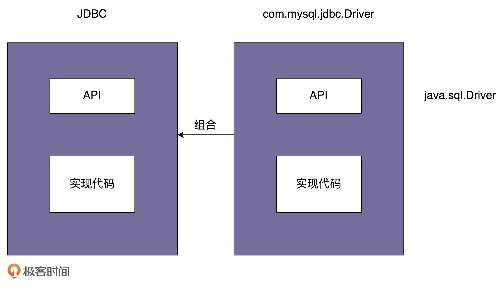

[toc]

## 49 | 桥接模式

-   代码实现非常简单，但，理解起来稍微有点难度。
-   了解即可。

### 原理解析

-   **桥接模式**，也叫作**桥梁模式**。

-   理解：

    -   “**将抽象和实现解耦，让它们可以独立变化。**” —— GoF 《设计模式》
    -   “**一个类存在两个（或多个）独立变化的维度，我们通过组合的方式，让这两个（或多个）维度可以独立进行扩展。**” —— 其他

-   下面通过 JDBC 驱动（桥接模式的经典应用）的例子来解释一下。下面是一段利用 JDBC 驱动来查询数据库。代码如下：

    -   ```java
        
        Class.forName("com.mysql.jdbc.Driver");//加载及注册JDBC驱动程序
        String url = "jdbc:mysql://localhost:3306/sample_db?user=root&password=your_password";
        Connection con = DriverManager.getConnection(url);
        Statement stmt = con.createStatement()；
        String query = "select * from test";
        ResultSet rs=stmt.executeQuery(query);
        while(rs.next()) {
          rs.getString(1);
          rs.getInt(2);
        }
        ```

-   JDBC 是如何优雅的实现数据库切换的呢？我们先从 com.mysql.jdbc.Driver 这个类看起。

    -   ```java
        
        package com.mysql.jdbc;
        import java.sql.SQLException;
        
        public class Driver extends NonRegisteringDriver implements java.sql.Driver {
          static {
            try {
              java.sql.DriverManager.registerDriver(new Driver());
            } catch (SQLException E) {
              throw new RuntimeException("Can't register driver!");
            }
          }
        
          /**
           * Construct a new driver and register it with DriverManager
           * @throws SQLException if a database error occurs.
           */
          public Driver() throws SQLException {
            // Required for Class.forName().newInstance()
          }
        }
        ```

-   DriverManager 类如下

    -   ```java
        
        public class DriverManager {
          private final static CopyOnWriteArrayList<DriverInfo> registeredDrivers = new CopyOnWriteArrayList<DriverInfo>();
        
          //...
          static {
            loadInitialDrivers();
            println("JDBC DriverManager initialized");
          }
          //...
        
          public static synchronized void registerDriver(java.sql.Driver driver) throws SQLException {
            if (driver != null) {
              registeredDrivers.addIfAbsent(new DriverInfo(driver));
            } else {
              throw new NullPointerException();
            }
          }
        
          public static Connection getConnection(String url, String user, String password) throws SQLException {
            java.util.Properties info = new java.util.Properties();
            if (user != null) {
              info.put("user", user);
            }
            if (password != null) {
              info.put("password", password);
            }
            return (getConnection(url, info, Reflection.getCallerClass()));
          }
          //...
        }
        ```

-   图例

    -   

### 应用举例

-   在 16 节中，我们讲过一个 API 接口监控告警的例子：根据不同的告警规则，触发不同类型的告警。

    -   告警支持多种通知渠道，包括：邮件、短信、微信、自动语音电话。
    -   紧急程度有多种类型，包括：Severe(严重)、Urgency(紧急)、Normal(普通)、Trivial(无关紧要)。

-   不同的紧急程度对应不同的通知渠道。

-   最简单、最直接的一个粗略实现的设计：

    -   ```java
        
        public enum NotificationEmergencyLevel {
          SEVERE, URGENCY, NORMAL, TRIVIAL
        }
        
        public class Notification {
          private List<String> emailAddresses;
          private List<String> telephones;
          private List<String> wechatIds;
        
          public Notification() {}
        
          public void setEmailAddress(List<String> emailAddress) {
            this.emailAddresses = emailAddress;
          }
        
          public void setTelephones(List<String> telephones) {
            this.telephones = telephones;
          }
        
          public void setWechatIds(List<String> wechatIds) {
            this.wechatIds = wechatIds;
          }
        
          public void notify(NotificationEmergencyLevel level, String message) {
            if (level.equals(NotificationEmergencyLevel.SEVERE)) {
              //...自动语音电话
            } else if (level.equals(NotificationEmergencyLevel.URGENCY)) {
              //...发微信
            } else if (level.equals(NotificationEmergencyLevel.NORMAL)) {
              //...发邮件
            } else if (level.equals(NotificationEmergencyLevel.TRIVIAL)) {
              //...发邮件
            }
          }
        }
        
        //在API监控告警的例子中，我们如下方式来使用Notification类：
        public class ErrorAlertHandler extends AlertHandler {
          public ErrorAlertHandler(AlertRule rule, Notification notification){
            super(rule, notification);
          }
        
        
          @Override
          public void check(ApiStatInfo apiStatInfo) {
            if (apiStatInfo.getErrorCount() > rule.getMatchedRule(apiStatInfo.getApi()).getMaxErrorCount()) {
              notification.notify(NotificationEmergencyLevel.SEVERE, "...");
            }
          }
        }
        ```

-   针对 Notification 的代码，我们将不同渠道的发送逻辑剥离出来，形成独立的消息发送类（MsgSender 相关类）。其中，Notification 类相当于抽象，MsgSender 类相当于实现，这两者可以独立开发。通过组合的关系（桥梁）任意组合在一起。

-   按照这个设计思路，我们对代码进行重构：

    -   ```java
        
        public interface MsgSender {
          void send(String message);
        }
        
        public class TelephoneMsgSender implements MsgSender {
          private List<String> telephones;
        
          public TelephoneMsgSender(List<String> telephones) {
            this.telephones = telephones;
          }
        
          @Override
          public void send(String message) {
            //...
          }
        
        }
        
        public class EmailMsgSender implements MsgSender {
          // 与TelephoneMsgSender代码结构类似，所以省略...
        }
        
        public class WechatMsgSender implements MsgSender {
          // 与TelephoneMsgSender代码结构类似，所以省略...
        }
        
        public abstract class Notification {
          protected MsgSender msgSender;
        
          public Notification(MsgSender msgSender) {
            this.msgSender = msgSender;
          }
        
          public abstract void notify(String message);
        }
        
        public class SevereNotification extends Notification {
          public SevereNotification(MsgSender msgSender) {
            super(msgSender);
          }
        
          @Override
          public void notify(String message) {
            msgSender.send(message);
          }
        }
        
        public class UrgencyNotification extends Notification {
          // 与SevereNotification代码结构类似，所以省略...
        }
        public class NormalNotification extends Notification {
          // 与SevereNotification代码结构类似，所以省略...
        }
        public class TrivialNotification extends Notification {
          // 与SevereNotification代码结构类似，所以省略...
        }
        ```

### 重点回顾

-   桥接模式的两种理解方式：
    1.  GoF 《设计模式》一书中，定义：“**将抽象和实现解耦，让它们可以独立变化。**”
    2.  “**一个类存在两个（或多个）独立变化的维度，我们通过组合的方式，让这两个（或多个）维度可以独立进行扩展。**”
-   对于第一种理解：
    -   “抽象”指的并非是“抽象类”或“接口”，而是抽象出来的一套“类库”，它只包含**骨架代码**，真正的业务逻辑需要委派给定义中的“实现”来完成。
    -   “实现”也并非“接口的实现类”，而是一套独立的“类库”。
    -   **“抽象”和“实现”独立开发，通过对象之间的组合关系组装在一起**。
-   对于第二种理解：
    -   非常类似“**组合优于继承**”设计原则。
    -   通过组合来替代继承关系，避免继承层次的指数级爆炸。