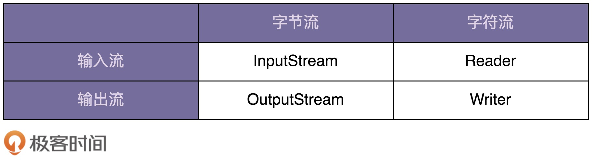
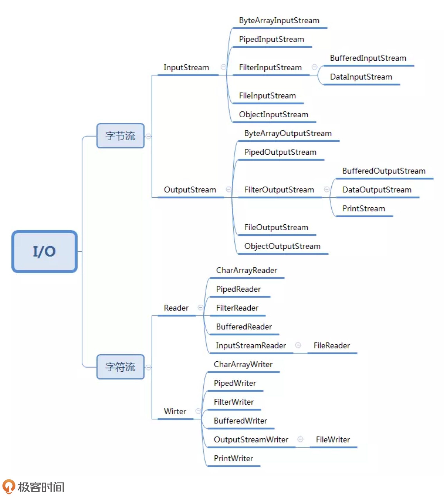

[toc]

## 50 | 装饰器模式：通过剖析 Java IO 类库源码学习装饰器模式

### Java IO 类的“奇怪”用法

-   对 Java IO 类做一个分类：

    -   

-   针对不同的读取和写入场景，Java IO 又在这四个父类基础上，扩展出很多子类，如下：

    -   

-   Java IO 用法示例：

    -   ```java
        
        InputStream in = new FileInputStream("/user/wangzheng/test.txt");
        InputStream bin = new BufferedInputStream(in);
        byte[] data = new byte[128];
        while (bin.read(data) != -1) {
          //...
        }
        ```

    -   

### 基于继承的设计方案

-   如果我们需要附加更多的增强功能，那就会导致组合爆炸，类继承结构变得无比复杂，代码既不好扩展也不好维护。
-   这也是我们讲的“不推荐使用继承”的原因。

### 基于装饰器模式的设计方案

-   在第 10 讲中，我们讲到“组合优于继承”，可以“**使用组合来替代继承**”。下面的代码展示了 Java IO 的这种设计思路。

    -   ```java
        
        public abstract class InputStream {
          //...
          public int read(byte b[]) throws IOException {
            return read(b, 0, b.length);
          }
          
          public int read(byte b[], int off, int len) throws IOException {
            //...
          }
          
          public long skip(long n) throws IOException {
            //...
          }
        
          public int available() throws IOException {
            return 0;
          }
          
          public void close() throws IOException {}
        
          public synchronized void mark(int readlimit) {}
            
          public synchronized void reset() throws IOException {
            throw new IOException("mark/reset not supported");
          }
        
          public boolean markSupported() {
            return false;
          }
        }
        
        public class BufferedInputStream extends InputStream {
          protected volatile InputStream in;
        
          protected BufferedInputStream(InputStream in) {
            this.in = in;
          }
          
          //...实现基于缓存的读数据接口...  
        }
        
        public class DataInputStream extends InputStream {
          protected volatile InputStream in;
        
          protected DataInputStream(InputStream in) {
            this.in = in;
          }
          
          //...实现读取基本类型数据的接口
        }
        ```

-   从上面 Java IO 的设计来看，装饰器模式相对于简单的组合关系，还有两个比较特殊的地方。

    -   第一：**装饰器类和原始类继承同样的父类，这样我们可以对原始类“嵌套”多个装饰器。**

        -   ```java
            
            InputStream in = new FileInputStream("/user/wangzheng/test.txt");
            InputStream bin = new BufferedInputStream(in);
            DataInputStream din = new DataInputStream(bin);
            int data = din.readInt();
            ```

    -   第二：**装饰器类是对功能的增强，这也是装饰器模式应用场景的一个重要特点。**

        -   ```java
            
            // 代理模式的代码结构(下面的接口也可以替换成抽象类)
            public interface IA {
              void f();
            }
            public class A impelements IA {
              public void f() { //... }
            }
            public class AProxy impements IA {
              private IA a;
              public AProxy(IA a) {
                this.a = a;
              }
              
              public void f() {
                // 新添加的代理逻辑
                a.f();
                // 新添加的代理逻辑
              }
            }
            
            // 装饰器模式的代码结构(下面的接口也可以替换成抽象类)
            public interface IA {
              void f();
            }
            public class A impelements IA {
              public void f() { //... }
            }
            public class ADecorator impements IA {
              private IA a;
              public ADecorator(IA a) {
                this.a = a;
              }
              
              public void f() {
                // 功能增强代码
                a.f();
                // 功能增强代码
              }
            }
            ```

-   在查看 JDK 的源码中，你会发现 BufferedInputStream、DataInputStream 并非继承自 InputStream，而是另一个 FilterInputStream 的类。那这又是为什么呢？

    -   对于即便是不需要增加缓存功能的函数来说，BufferedInputStream 还是必须把它重新实现一遍，简单包裹对 InputStream 对象的函数调用。代码如下。如果不重新实现，那 BufferedInputStream 类就无法将最终读取数据的任务，委托给传递进来的 InpuStream 对象来完成。

    -   ```java
        
        public class BufferedInputStream extends InputStream {
          protected volatile InputStream in;
        
          protected BufferedInputStream(InputStream in) {
            this.in = in;
          }
          
          // f()函数不需要增强，只是重新调用一下InputStream in对象的f()
          public void f() {
            in.f();
          }  
        }
        ```

    -   实际上，DataInputStream 也存在跟 BufferedInputStream 同样的问题。为避免代码重复，Java IO 抽象出一个装饰器父类 FilterInputStream，代码实现如下。InputStream 的所有装饰器类（BufferedInputStream、DataInputStream）都继承自这个装饰器父类。这样，装饰器只需要实现它需要增强的方法就可以了，其他方法继承自父类的默认实现。

    -   ```java
        
        public class FilterInputStream extends InputStream {
          protected volatile InputStream in;
        
          protected FilterInputStream(InputStream in) {
            this.in = in;
          }
        
          public int read() throws IOException {
            return in.read();
          }
        
          public int read(byte b[]) throws IOException {
            return read(b, 0, b.length);
          }
           
          public int read(byte b[], int off, int len) throws IOException {
            return in.read(b, off, len);
          }
        
          public long skip(long n) throws IOException {
            return in.skip(n);
          }
        
          public int available() throws IOException {
            return in.available();
          }
        
          public void close() throws IOException {
            in.close();
          }
        
          public synchronized void mark(int readlimit) {
            in.mark(readlimit);
          }
        
          public synchronized void reset() throws IOException {
            in.reset();
          }
        
          public boolean markSupported() {
            return in.markSupported();
          }
        }
        ```

    -   

### 重点回顾

-   装饰器模式主要解决继承关系过于复杂的问题，通过**组合来替代继承**。
-   它主要的作用是**给原始类添加增强功能**。这也是判断是否该用装饰器模式的一个重要的依据。
-   此外，还有一个特点，那就是可以对原始类嵌套使用多个装饰器。为了满足这个应用场景，在设计的时候，**装饰器类需要跟原始类继承相同的抽象类或接口**。