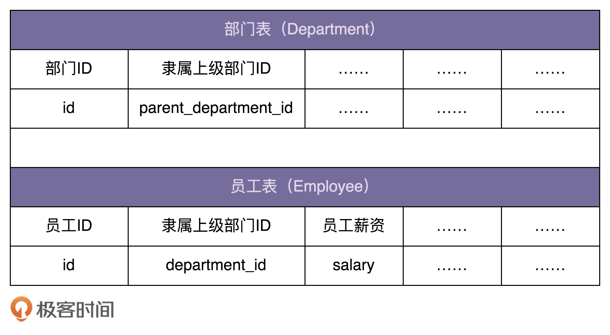

[toc]

## 53 | 组合模式：如何设计实现递归遍历文件系统目录树结构？

-   这里讲的“组合模式”，主要用来处理树形结构数据。

### 组合模式的原理与实现

-   **组合模式**，将一组对象组织成树形结构，以表示一种“部分-整体”的层次结构。组合让客户端可以统一单个对象和组合对象的处理逻辑。 ---- GoF 《设计模式》

-   示例：

    -   需求：设计一个类来表示文件系统中的目录，能方便地实现下面这些功能：
        -   动态地添加、删除某个目录下的子目录或文件。
        -   统计指定目录下的文件个数。
        -   统计指定目录下的文件总大小。
        
    -   下面给出了这个类的骨架代码，核心逻辑并未实现。

    -   ```java

        public class FileSystemNode {
          private String path;
          private boolean isFile;
          private List<FileSystemNode> subNodes = new ArrayList<>();

          public FileSystemNode(String path, boolean isFile) {
            this.path = path;
            this.isFile = isFile;
          }

          public int countNumOfFiles() {
            // TODO:...
          }

          public long countSizeOfFiles() {
            // TODO:...
          }

          public String getPath() {
            return path;
          }

          public void addSubNode(FileSystemNode fileOrDir) {
            subNodes.add(fileOrDir);
          }

          public void removeSubNode(FileSystemNode fileOrDir) {
            int size = subNodes.size();
            int i = 0;
            for (; i < size; ++i) {
              if (subNodes.get(i).getPath().equalsIgnoreCase(fileOrDir.getPath())) {
                break;
              }
            }
            if (i < size) {
              subNodes.remove(i);
            }
          }
        }
        ```
        
    -   补全 countNumOfFiles() 和 countSizeOfFiles() 这两个函数。

    -   ```java
        
          public int countNumOfFiles() {
            if (isFile) {
              return 1;
            }
            int numOfFiles = 0;
            for (FileSystemNode fileOrDir : subNodes) {
              numOfFiles += fileOrDir.countNumOfFiles();
            }
            return numOfFiles;
          }
        
          public long countSizeOfFiles() {
            if (isFile) {
              File file = new File(path);
              if (!file.exists()) return 0;
              return file.length();
            }
            long sizeofFiles = 0;
            for (FileSystemNode fileOrDir : subNodes) {
              sizeofFiles += fileOrDir.countSizeOfFiles();
            }
            return sizeofFiles;
          }
        ```

-   对上面代码进行重构，设计思路：从扩展性、业务建模、可读性的角度来说，我们最好对文件和目录进行区分设计。

    -   ```java 
        
        public abstract class FileSystemNode {
          protected String path;
        
          public FileSystemNode(String path) {
            this.path = path;
          }
        
          public abstract int countNumOfFiles();
          public abstract long countSizeOfFiles();
        
          public String getPath() {
            return path;
          }
        }
        
        public class File extends FileSystemNode {
          public File(String path) {
            super(path);
          }
        
          @Override
          public int countNumOfFiles() {
            return 1;
          }
        
          @Override
          public long countSizeOfFiles() {
            java.io.File file = new java.io.File(path);
            if (!file.exists()) return 0;
            return file.length();
          }
        }
        
        public class Directory extends FileSystemNode {
          private List<FileSystemNode> subNodes = new ArrayList<>();
        
          public Directory(String path) {
            super(path);
          }
        
          @Override
          public int countNumOfFiles() {
            int numOfFiles = 0;
            for (FileSystemNode fileOrDir : subNodes) {
              numOfFiles += fileOrDir.countNumOfFiles();
            }
            return numOfFiles;
          }
        
          @Override
          public long countSizeOfFiles() {
            long sizeofFiles = 0;
            for (FileSystemNode fileOrDir : subNodes) {
              sizeofFiles += fileOrDir.countSizeOfFiles();
            }
            return sizeofFiles;
          }
        
          public void addSubNode(FileSystemNode fileOrDir) {
            subNodes.add(fileOrDir);
          }
        
          public void removeSubNode(FileSystemNode fileOrDir) {
            int size = subNodes.size();
            int i = 0;
            for (; i < size; ++i) {
              if (subNodes.get(i).getPath().equalsIgnoreCase(fileOrDir.getPath())) {
                break;
              }
            }
            if (i < size) {
              subNodes.remove(i);
            }
          }
        }
        ```

    -   如何用它们来表示一个文件系统中的目录树结构，具体代码如下：

    -   ```java
        
        public class Demo {
          public static void main(String[] args) {
            /**
             * /
             * /wz/
             * /wz/a.txt
             * /wz/b.txt
             * /wz/movies/
             * /wz/movies/c.avi
             * /xzg/
             * /xzg/docs/
             * /xzg/docs/d.txt
             */
            Directory fileSystemTree = new Directory("/");
            Directory node_wz = new Directory("/wz/");
            Directory node_xzg = new Directory("/xzg/");
            fileSystemTree.addSubNode(node_wz);
            fileSystemTree.addSubNode(node_xzg);
        
            File node_wz_a = new File("/wz/a.txt");
            File node_wz_b = new File("/wz/b.txt");
            Directory node_wz_movies = new Directory("/wz/movies/");
            node_wz.addSubNode(node_wz_a);
            node_wz.addSubNode(node_wz_b);
            node_wz.addSubNode(node_wz_movies);
        
            File node_wz_movies_c = new File("/wz/movies/c.avi");
            node_wz_movies.addSubNode(node_wz_movies_c);
        
            Directory node_xzg_docs = new Directory("/xzg/docs/");
            node_xzg.addSubNode(node_xzg_docs);
        
            File node_xzg_docs_d = new File("/xzg/docs/d.txt");
            node_xzg_docs.addSubNode(node_xzg_docs_d);
        
            System.out.println("/ files num:" + fileSystemTree.countNumOfFiles());
            System.out.println("/wz/ files num:" + node_wz.countNumOfFiles());
          }
        }
        ```

-   实际上，刚这种组合模式的设计思路，与其说是一种设计模式，例不如说是对业务场景的一种数据结构和算法的抽象。

### 组合模式的应用场景举例

-   需求，假设我们在开发一个 OA 系统。公司组织结构如下。我们希望在内存中构建整个公司的人员架构图，并提供接口计算出部门的薪资成本。
    -   

-   代码如下：

    -   ```java
        
        public abstract class HumanResource {
          protected long id;
          protected double salary;
        
          public HumanResource(long id) {
            this.id = id;
          }
        
          public long getId() {
            return id;
          }
        
          public abstract double calculateSalary();
        }
        
        public class Employee extends HumanResource {
          public Employee(long id, double salary) {
            super(id);
            this.salary = salary;
          }
        
          @Override
          public double calculateSalary() {
            return salary;
          }
        }
        
        public class Department extends HumanResource {
          private List<HumanResource> subNodes = new ArrayList<>();
        
          public Department(long id) {
            super(id);
          }
        
          @Override
          public double calculateSalary() {
            double totalSalary = 0;
            for (HumanResource hr : subNodes) {
              totalSalary += hr.calculateSalary();
            }
            this.salary = totalSalary;
            return totalSalary;
          }
        
          public void addSubNode(HumanResource hr) {
            subNodes.add(hr);
          }
        }
        
        // 构建组织架构的代码
        public class Demo {
          private static final long ORGANIZATION_ROOT_ID = 1001;
          private DepartmentRepo departmentRepo; // 依赖注入
          private EmployeeRepo employeeRepo; // 依赖注入
        
          public void buildOrganization() {
            Department rootDepartment = new Department(ORGANIZATION_ROOT_ID);
            buildOrganization(rootDepartment);
          }
        
          private void buildOrganization(Department department) {
            List<Long> subDepartmentIds = departmentRepo.getSubDepartmentIds(department.getId());
            for (Long subDepartmentId : subDepartmentIds) {
              Department subDepartment = new Department(subDepartmentId);
              department.addSubNode(subDepartment);
              buildOrganization(subDepartment);
            }
            List<Long> employeeIds = employeeRepo.getDepartmentEmployeeIds(department.getId());
            for (Long employeeId : employeeIds) {
              double salary = employeeRepo.getEmployeeSalary(employeeId);
              department.addSubNode(new Employee(employeeId, salary));
            }
          }
        }
        ```

    -   

### 重点回顾

-   组合模式的设计思路，与其说是一种设计模式，例不如说是**对业务场景的一种数据结构和算法的抽象**。其中，数据可以表示成树这种数据结构，业务需要可以通过在树上的递归遍历算法来实现。
-   组合模式，将一组对象组织成树形结构，将单个对象和组合对象都看做树中节点，以统一处理逻辑，并且，它利用树形结构的特点，递归地处理每个子树，依次简化代码实现。
-   使用组合模式的前提在于，你的业务场景必须能够表示成树形结构。所以，组合模式的应用场景也比较局限，它并不是一种很常用的设计模式。

