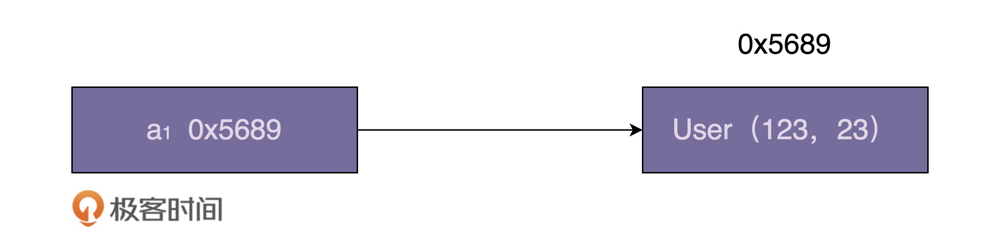
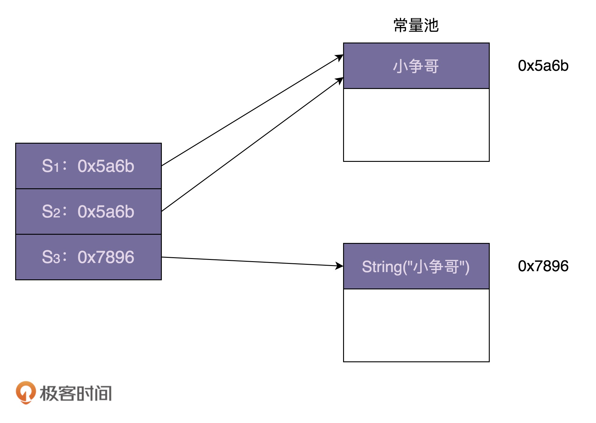

[toc]

## 55 | 享元模式（下）：剖析享元模式在 Java Integer、String 中的应用

### 享元模式在 Java Integer 中的应用

-   示例代码

    -   ```java
        
        User a = new User(123, 23); // id=123, age=23
        ```

-   下图是一张内存存储结构图

    -   

-   在 Java 中，通过 “==” 来判定两个对象是否相等的时候，实际上是在判断两个局部变量存储的地址是否相同。换句话来说，是在判断两个局部变量是否指向相同的对象。

-   观察如下代码

    -   ```java
        
        Integer i1 = 56;
        Integer i2 = 56;
        Integer i3 = 129;
        Integer i4 = 129;
        System.out.println(i1 == i2);
        System.out.println(i3 == i4);
        ```

    -   答案并非是两个 false，而是一个 true，一个 false。

-   实际上，这正是因为 Integer 用到了享元模式来复用对象，才导致这样的结果。

-   当我们通过自动装箱，也就是调用 valueOf() 来创建 Integer 对象的时候，**如果要创建的对象值在 -128 到 127 之间，会从 IntegerCache 类中直接返回，否则才调用 new 方法创建**。Integer 类的 valueOf() 函数的代码如下：

    -   ```java
        
        public static Integer valueOf(int i) {
            if (i >= IntegerCache.low && i <= IntegerCache.high)
                return IntegerCache.cache[i + (-IntegerCache.low)];
            return new Integer(i);
        }
        ```

-   这里的 IntegerCache 相当于“生成享元对象的工厂类”。如下是 Integer 的内部类

    -   ```java
        
        /**
         * Cache to support the object identity semantics of autoboxing for values between
         * -128 and 127 (inclusive) as required by JLS.
         *
         * The cache is initialized on first usage.  The size of the cache
         * may be controlled by the {@code -XX:AutoBoxCacheMax=<size>} option.
         * During VM initialization, java.lang.Integer.IntegerCache.high property
         * may be set and saved in the private system properties in the
         * sun.misc.VM class.
         */
        private static class IntegerCache {
            static final int low = -128;
            static final int high;
            static final Integer cache[];
        
            static {
                // high value may be configured by property
                int h = 127;
                String integerCacheHighPropValue =
                    sun.misc.VM.getSavedProperty("java.lang.Integer.IntegerCache.high");
                if (integerCacheHighPropValue != null) {
                    try {
                        int i = parseInt(integerCacheHighPropValue);
                        i = Math.max(i, 127);
                        // Maximum array size is Integer.MAX_VALUE
                        h = Math.min(i, Integer.MAX_VALUE - (-low) -1);
                    } catch( NumberFormatException nfe) {
                        // If the property cannot be parsed into an int, ignore it.
                    }
                }
                high = h;
        
                cache = new Integer[(high - low) + 1];
                int j = low;
                for(int k = 0; k < cache.length; k++)
                    cache[k] = new Integer(j++);
        
                // range [-128, 127] must be interned (JLS7 5.1.7)
                assert IntegerCache.high >= 127;
            }
        
            private IntegerCache() {}
        }
        ```

-   **在 IntegerCache 的代码实现中，当这个类被加载的时候，缓存的享元对象会被集中一次性创建好。**

-   你也可以用如下方式，将 IntegerCache 缓存的最大值从 127 调整到 255。

    -   ```java
        
        //方法一：
        -Djava.lang.Integer.IntegerCache.high=255
        //方法二：
        -XX:AutoBoxCacheMax=255
        ```

-   除了 Integer 类型外，其他包装器类型，如 Long、Short、Byte 等，也都利用了享元模式来缓存 -128 到 127 之间的数据。如 Long 类型对应的 LongCache 享元工厂类及 valueOf() 函数代码如下：

    -   ```java
        
        private static class LongCache {
            private LongCache(){}
        
            static final Long cache[] = new Long[-(-128) + 127 + 1];
        
            static {
                for(int i = 0; i < cache.length; i++)
                    cache[i] = new Long(i - 128);
            }
        }
        
        public static Long valueOf(long l) {
            final int offset = 128;
            if (l >= -128 && l <= 127) { // will cache
                return LongCache.cache[(int)l + offset];
            }
            return new Long(l);
        }
        ```

-   平时开发中，对于下面三种创建整型对象的方式，我们**优先使用后两种**：

    -   ```java
        
        Integer a = new Integer(123);
        Integer a = 123;
        Integer a = Integer.valueOf(123);
        ```

    -   

### 享元模式在 Java String 中的应用

-   示例：

    -   ```java
        
        String s1 = "小争哥";
        String s2 = "小争哥";
        String s3 = new String("小争哥");
        
        System.out.println(s1 == s2);
        System.out.println(s1 == s3);
        ```

    -   结果一个是 true，一个是 false。

-   跟 Integer 类的设计思路相似，String 类利用享元模式来复用相同的字符串常量。JVM 会专门开辟一块存储区来存储字符串常量，这块存储区中“字符串常量池”

    -   

-   跟 Integer 稍微不同，Integer 类中要共享的对象，是在类加载的时候，就集中一次性创建好的。对于字符串，我们没法事先知道要共享哪些字符串常量，所以没法事先创建好，**只能在字符串常量第一次被用到的时候，存储到常量池中，当之后再用的时候，直接引用常量池中已经存在的即可，就不需要再重新创建了。**

### 重点回顾

-   在 Java Integer 的实现中，**-128 到 127 之间的整型对象会被事先创建好，缓存在 IntegerCache 类中**。当我们使用自动装箱或 valueOf() 来创建这个数值区间的整型对象时，会复用 IntegerCache 类事先创建好的对象。
-   在 Java String 类的实现中，JVM 开辟一块存储区专门存储字符串常量，这块存储区叫**字符串常量池**，类似 IntegerCache。不过，与 IntegerCache 不同的是，它并非事先创建好需要的共享对，而是在**程序的运行期间，根据需要来创建和缓存字符串常量**。

-   在某些情况下，如果对象的生命周期很短，也不会被密集使用，利用享元模式反倒可能会浪费更多内存。