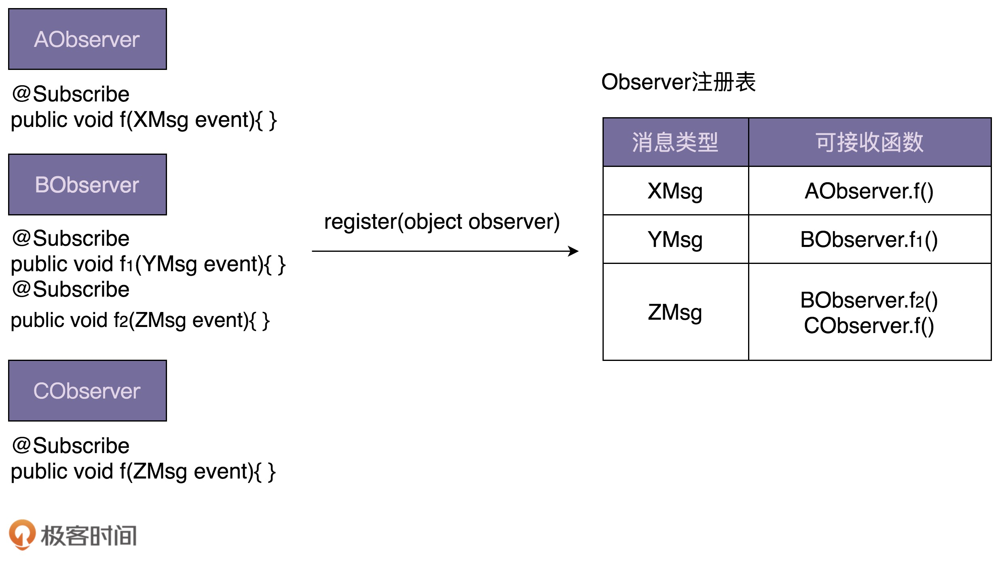
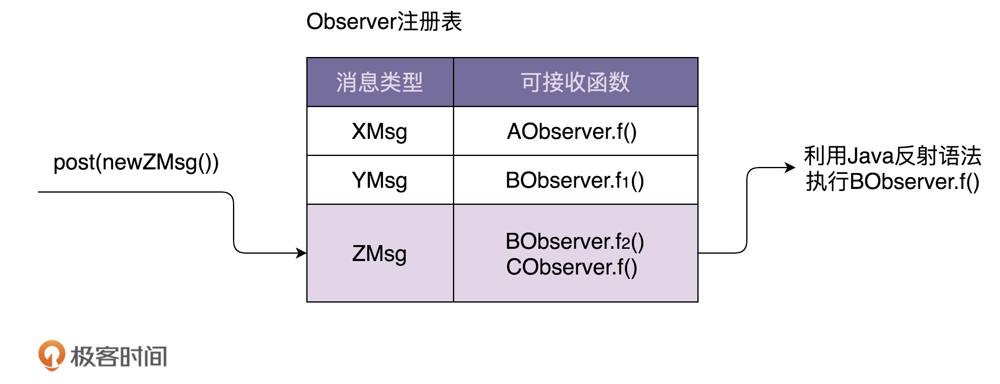

[toc]

## 57 | 观察者模式（下）：如何实现一个异步非阻塞的 EventBus 框架？

-   今天，我们聚焦于**异步非阻塞的观察者模式**，带你来实现一个类似 Google Guava EventBus 的通用框架。

### 异步非阻塞观察者模式的简易实现

-   先实现一个简易版本，不考虑任何通用性、复用性。

    -   一种方式：在每个 handleRegSuccess() 函数中创建一个新的线程执行代码逻辑。
    -   另一种方式：在 UserController 的 register() 函数中使用线程池来执行每个观察者的 handleRegSuccess() 函数：

-   代码如下：

    -   ```java
        
        // 第一种实现方式，其他类代码不变，就没有再重复罗列
        public class RegPromotionObserver implements RegObserver {
          private PromotionService promotionService; // 依赖注入
        
          @Override
          public void handleRegSuccess(long userId) {
            Thread thread = new Thread(new Runnable() {
              @Override
              public void run() {
                promotionService.issueNewUserExperienceCash(userId);
              }
            });
            thread.start();
          }
        }
        
        // 第二种实现方式，其他类代码不变，就没有再重复罗列
        public class UserController {
          private UserService userService; // 依赖注入
          private List<RegObserver> regObservers = new ArrayList<>();
          private Executor executor;
        
          public UserController(Executor executor) {
            this.executor = executor;
          }
        
          public void setRegObservers(List<RegObserver> observers) {
            regObservers.addAll(observers);
          }
        
          public Long register(String telephone, String password) {
            //省略输入参数的校验代码
            //省略userService.register()异常的try-catch代码
            long userId = userService.register(telephone, password);
        
            for (RegObserver observer : regObservers) {
              executor.execute(new Runnable() {
                @Override
                public void run() {
                  observer.handleRegSuccess(userId);
                }
              });
            }
        
            return userId;
          }
        }
        ```

    -   对于第一种实现方式，频繁地创建和销毁线程比较耗时，并且并发线程无法控制，创建过多的线程会导致堆栈溢出。

    -   对于第二种实现方式，解决了第一种方式的问题，但，线程池、异步执行逻辑都会耦合在了 register() 函数中，增加了这部分业务代码的维护成本。

-   框架的作用：**隐藏实现细节，降低开发难度，代码复用，解耦业务与非业务代码，让程序员聚焦业务开发。**

### EventBus 框架功能需求介绍

-   EventBus (“事件总线”)，它提供了实现观察者模式的骨架代码。

-   Google Guava EventBus 就是一个比较著名的 EventBus 框架，不仅支持异步非阻塞，也支持同步阻塞。

-   使用 Guava EventBus 来重新实现一下“用户注册”的例子。 
    -   ```java

        public class UserController {
          private UserService userService; // 依赖注入

          private EventBus eventBus;
          private static final int DEFAULT_EVENTBUS_THREAD_POOL_SIZE = 20;

          public UserController() {
            //eventBus = new EventBus(); // 同步阻塞模式
            eventBus = new AsyncEventBus(Executors.newFixedThreadPool(DEFAULT_EVENTBUS_THREAD_POOL_SIZE)); // 异步非阻塞模式
          }

          public void setRegObservers(List<Object> observers) {
            for (Object observer : observers) {
              eventBus.register(observer);
            }
          }

          public Long register(String telephone, String password) {
            //省略输入参数的校验代码
            //省略userService.register()异常的try-catch代码
            long userId = userService.register(telephone, password);

            eventBus.post(userId);

            return userId;
          }
        }

        public class RegPromotionObserver {
          private PromotionService promotionService; // 依赖注入

          @Subscribe
          public void handleRegSuccess(long userId) {
            promotionService.issueNewUserExperienceCash(userId);
          }
        }

        public class RegNotificationObserver {
          private NotificationService notificationService;

          @Subscribe
          public void handleRegSuccess(long userId) {
            notificationService.sendInboxMessage(userId, "...");
          }
        }
        ```
        
    -   实现细节上。基于 EventBus，我们不需要定义 Observer 接口，任何类型的对象都可以注册到 EventBus 中，通过 @Subscribe 注解来标明类中哪些函数可以接收被观察者发送的消息。
    
-   我们来详细讲下，Guava EventBus 的几个主要的类和函数：

    -   EventBus、AsyncEventBus

        -   Guava EventBus 对外暴露所有可调用的接口，都封装在 EventBus 类中。

        -   ```java
            
            EventBus eventBus = new EventBus(); // 同步阻塞模式
            EventBus eventBus = new AsyncEventBus(Executors.newFixedThreadPool(8))；// 异步阻塞模式
            ```

        -   

    -   register() 函数

        -   有来注册观察者。

        -   ```java
            
            public void register(Object object);
            ```

    -   unregister() 函数

        -   删除某个观察者。

        -   ```java
            
            public void unregister(Object object);
            ```

        -   

    -   post() 函数

        -   用来给观察者发送消息

        -   ```java
            
            public void post(Object event);
            ```

        -   跟经典的观察者模式的不同之处在于，我们调用 post() 函数发送消息的时候，并非把消息发送给所有观察者，而是发送给可**匹配的观察者**。

        -   所谓可匹配指的是，**能接收消息类型是发送消息类型的子类**。

        -   代码如下：其中，XMsg 是 YMsg 的父类。

        -   ```java
            
            XMsg xMsg = new XMsg();
            YMsg yMsg = new YMsg();
            ZMsg zMsg = new ZMsg();
            post(xMsg); => AObserver、BObserver接收到消息
            post(yMsg); => BObserver接收到消息
            post(zMsg); => CObserver接收到消息
            ```

        -   

    -   `@Subscribe` 注解

        -   标明某个函数**能接收哪种类型的消息**

        -   ```java
            
            public DObserver {
              //...省略其他属性和方法...
              
              @Subscribe
              public void f1(PMsg event) { //... }
              
              @Subscribe
              public void f2(QMsg event) { //... }
            }
            ```

        -   
### 手工实现一个 EventBus 框架

-   下面，我们来“山寨”一个 EventBus 出来。

#### 原理

-   重点来看，EventBus 中**两个核心函数 register() 和 post()** 的实现原理。下面两张图就是这两个函数的实现原理图。
    -   
    -   
-   图中看出，**最关键的一个数据结构是 Observer 注册表，记录了消息类型和可接收消息函数的对应关系。**
-   当 register() 函数注册观察者的时候，EventBus 通过解析 `@Subscribe` 注解，生成 Observer 注册表。
-   当 post() 函数发送消息的时候，EventBus 通过注册表找到相应的可接收消息的函数。
-   对于同步阻塞模式，EventBus 在一个线程内依次执行相应的函数。
-   对于异步非阻塞模式，EventBus 通过一个线程池来执行相应的函数。

#### 实现

-   整个小框架代码实现包括 5 个类

    1.  **Subscribe**

        -   是一个注解，用于标明观察者中哪个函数可以接收消息。

        -   ```java
            
            @Retention(RetentionPolicy.RUNTIME)
            @Target(ElementType.METHOD)
            @Beta
            public @interface Subscribe {}
            ```

        -   

    2.  **ObserverAction**

        -   ObserverAction 类用来表示 @Subscribe 注解方法，其中，target 表示观察者类，method 表示方法，它主要用在 ObserverRegistry 观察者注册表中。

        -   ```java
            
            public class ObserverAction {
              private Object target;
              private Method method;
            
              public ObserverAction(Object target, Method method) {
                this.target = Preconditions.checkNotNull(target);
                this.method = method;
                this.method.setAccessible(true);
              }
            
              public void execute(Object event) { // event是method方法的参数
                try {
                  method.invoke(target, event);
                } catch (InvocationTargetException | IllegalAccessException e) {
                  e.printStackTrace();
                }
              }
            }
            ```

        -   

    3.  **ObserverRegistry**

        -   ObserverRegistry 类就是前面讲到的 Observer 注册表，是最复杂的一个类，框架中几乎所有的核心逻辑都在这个类中。

        -   其中，一个比较有技巧的地方是 **CopyOnWriteArraySet** 的使用。

        -   顾名思义，在写入数据的时候，会创建一个新的 set，并且将原始的数据 clone 到新的 set 中，在新的 set 中写入数据完成后，再用新的 set 替换老的 set。

        -   这样，就能保证写入数据的时候，不影响数据的读取操作，以此来解决读写并发问题。

        -   此外，CopyOnWriteSet 还通过加锁的方式，避免了并发写冲突。具体可以查看源码。

        -   ```java
            
            public class ObserverRegistry {
              private ConcurrentMap<Class<?>, CopyOnWriteArraySet<ObserverAction>> registry = new ConcurrentHashMap<>();
            
              public void register(Object observer) {
                Map<Class<?>, Collection<ObserverAction>> observerActions = findAllObserverActions(observer);
                for (Map.Entry<Class<?>, Collection<ObserverAction>> entry : observerActions.entrySet()) {
                  Class<?> eventType = entry.getKey();
                  Collection<ObserverAction> eventActions = entry.getValue();
                  CopyOnWriteArraySet<ObserverAction> registeredEventActions = registry.get(eventType);
                  if (registeredEventActions == null) {
                    registry.putIfAbsent(eventType, new CopyOnWriteArraySet<>());
                    registeredEventActions = registry.get(eventType);
                  }
                  registeredEventActions.addAll(eventActions);
                }
              }
            
              public List<ObserverAction> getMatchedObserverActions(Object event) {
                List<ObserverAction> matchedObservers = new ArrayList<>();
                Class<?> postedEventType = event.getClass();
                for (Map.Entry<Class<?>, CopyOnWriteArraySet<ObserverAction>> entry : registry.entrySet()) {
                  Class<?> eventType = entry.getKey();
                  Collection<ObserverAction> eventActions = entry.getValue();
                  if (eventType.isAssignableFrom(postedEventType)) {
                    matchedObservers.addAll(eventActions);
                  }
                }
                return matchedObservers;
              }
            
              private Map<Class<?>, Collection<ObserverAction>> findAllObserverActions(Object observer) {
                Map<Class<?>, Collection<ObserverAction>> observerActions = new HashMap<>();
                Class<?> clazz = observer.getClass();
                for (Method method : getAnnotatedMethods(clazz)) {
                  Class<?>[] parameterTypes = method.getParameterTypes();
                  Class<?> eventType = parameterTypes[0];
                  if (!observerActions.containsKey(eventType)) {
                    observerActions.put(eventType, new ArrayList<>());
                  }
                  observerActions.get(eventType).add(new ObserverAction(observer, method));
                }
                return observerActions;
              }
            
              private List<Method> getAnnotatedMethods(Class<?> clazz) {
                List<Method> annotatedMethods = new ArrayList<>();
                for (Method method : clazz.getDeclaredMethods()) {
                  if (method.isAnnotationPresent(Subscribe.class)) {
                    Class<?>[] parameterTypes = method.getParameterTypes();
                    Preconditions.checkArgument(parameterTypes.length == 1,
                            "Method %s has @Subscribe annotation but has %s parameters."
                                    + "Subscriber methods must have exactly 1 parameter.",
                            method, parameterTypes.length);
                    annotatedMethods.add(method);
                  }
                }
                return annotatedMethods;
              }
            }
            ```

        -   

    4.  **EventBus**

        -   EventBus 实现的是阻塞同步的观察者模式。

        -   ```java
            
            public class EventBus {
              private Executor executor;
              private ObserverRegistry registry = new ObserverRegistry();
            
              public EventBus() {
                this(MoreExecutors.directExecutor());
              }
            
              protected EventBus(Executor executor) {
                this.executor = executor;
              }
            
              public void register(Object object) {
                registry.register(object);
              }
            
              public void post(Object event) {
                List<ObserverAction> observerActions = registry.getMatchedObserverActions(event);
                for (ObserverAction observerAction : observerActions) {
                  executor.execute(new Runnable() {
                    @Override
                    public void run() {
                      observerAction.execute(event);
                    }
                  });
                }
              }
            }
            ```

        -   

    5.  **AsyncEventBus**

        -   ```java
            
            public class AsyncEventBus extends EventBus {
              public AsyncEventBus(Executor executor) {
                super(executor);
              }
            }
            ```

-   从功能上来讲，它跟 Google Guava EventBus 几乎一样。不过，如果查看 [Google Guava EventBus](https://github.com/google/guava) 源码。会发现，在实现细节方面，它其实做了很多优化。建议去读下源码。

### 重点回顾

-   框架的作用有：隐藏实现细节，降低开发难度，代码复用，解耦业务与非业务代码。
-   EventBus 它提供实现观察者模式的骨架代码。


