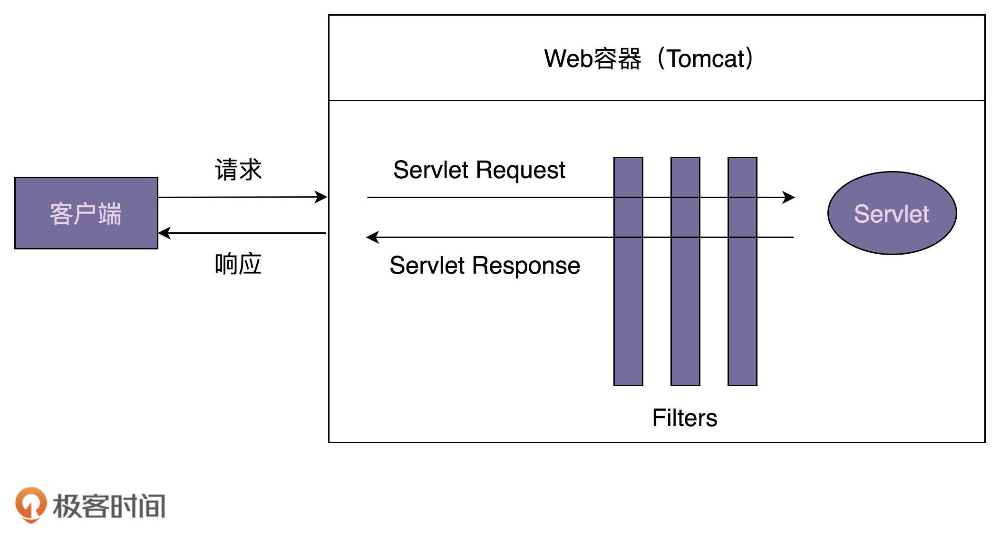
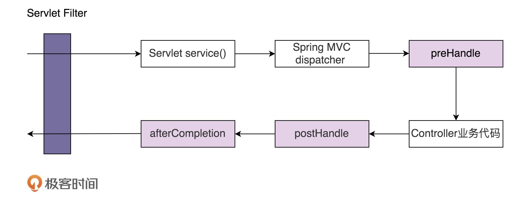

[toc]

## 63 | 职责链模式（下）：框架中常用的过滤器、拦截器是如何实现的？

-   具体来说，职责链最常用来开发框架的**过滤器**和**拦截器**。

### Servlet Filter

-   Servlet 是 Java Servlet 规范中定义的组件，中文叫过滤器，它可以实现对 HTTP 请求的过滤功能。它的工作原理如下图：
    -   

-   使用 Servlet Filter 的一段简单的示例代码，如下：

    -   ```java
        
        public class LogFilter implements Filter {
          @Override
          public void init(FilterConfig filterConfig) throws ServletException {
            // 在创建Filter时自动调用，
            // 其中filterConfig包含这个Filter的配置参数，比如name之类的（从配置文件中读取的）
          }
        
          @Override
          public void doFilter(ServletRequest request, ServletResponse response, FilterChain chain) throws IOException, ServletException {
            System.out.println("拦截客户端发送来的请求.");
            chain.doFilter(request, response);
            System.out.println("拦截发送给客户端的响应.");
          }
        
          @Override
          public void destroy() {
            // 在销毁Filter时自动调用
          }
        }
        
        // 在web.xml配置文件中如下配置：
        <filter>
          <filter-name>logFilter</filter-name>
          <filter-class>com.xzg.cd.LogFilter</filter-class>
        </filter>
        <filter-mapping>
            <filter-name>logFilter</filter-name>
            <url-pattern>/*</url-pattern>
        </filter-mapping>
        ```

-   Servlet 只是一个规范，并不包含具体的实现，所以，Servlet 中的 FilterChain 只是一个接口定义。

-   ApplicationFilterChain 类就是 Tomcat 提供的 FilterChain 的实现类，源码如下：

    -   ```java
        
        public final class ApplicationFilterChain implements FilterChain {
          private int pos = 0; //当前执行到了哪个filter
          private int n; //filter的个数
          private ApplicationFilterConfig[] filters;
          private Servlet servlet;
          
          @Override
          public void doFilter(ServletRequest request, ServletResponse response) {
            if (pos < n) {
              ApplicationFilterConfig filterConfig = filters[pos++];
              Filter filter = filterConfig.getFilter();
              filter.doFilter(request, response, this);
            } else {
              // filter都处理完毕后，执行servlet
              servlet.service(request, response);
            }
          }
          
          public void addFilter(ApplicationFilterConfig filterConfig) {
            for (ApplicationFilterConfig filter:filters)
              if (filter==filterConfig)
                 return;
        
            if (n == filters.length) {//扩容
              ApplicationFilterConfig[] newFilters = new ApplicationFilterConfig[n + INCREMENT];
              System.arraycopy(filters, 0, newFilters, 0, n);
              filters = newFilters;
            }
            filters[n++] = filterConfig;
          }
        }
        ```

    -   

### Spring Interceptor

-   Spring Interceptor（拦截器），是 Spring MVC 框架的一部分，由 Spring MVC 框架来提供实现。客户端发送的请求，会先经过 Servlet Filter 再经过 Spring Interceptor，最达到达具体的业务代码中。流程如下：

    -   

-   LogFilter 对请求和响应的拦截是在 doFilter() 一个函数中实现的，而 LogInterceptor 对请求的拦截是在 preHandle() 中实现，对响应的的拦截是在 postHandle() 中实现。

    -   ```java
        
        public class LogInterceptor implements HandlerInterceptor {
        
          @Override
          public boolean preHandle(HttpServletRequest request, HttpServletResponse response, Object handler) throws Exception {
            System.out.println("拦截客户端发送来的请求.");
            return true; // 继续后续的处理
          }
        
          @Override
          public void postHandle(HttpServletRequest request, HttpServletResponse response, Object handler, ModelAndView modelAndView) throws Exception {
            System.out.println("拦截发送给客户端的响应.");
          }
        
          @Override
          public void afterCompletion(HttpServletRequest request, HttpServletResponse response, Object handler, Exception ex) throws Exception {
            System.out.println("这里总是被执行.");
          }
        }
        
        //在Spring MVC配置文件中配置interceptors
        <mvc:interceptors>
           <mvc:interceptor>
               <mvc:mapping path="/*"/>
               <bean class="com.xzg.cd.LogInterceptor" />
           </mvc:interceptor>
        </mvc:interceptors>
        ```

-   我们来剖析一下，Spring Interceptor 底层是如何实现的。

-   它也是基于职责链模式实现的，其中，HandleExecutionCahin 类是职责链模式中的处理器链。HandleExecutionCahin 的源码如下：

    -   ```java
        
        public class HandlerExecutionChain {
         private final Object handler;
         private HandlerInterceptor[] interceptors;
         
         public void addInterceptor(HandlerInterceptor interceptor) {
          initInterceptorList().add(interceptor);
         }
        
         boolean applyPreHandle(HttpServletRequest request, HttpServletResponse response) throws Exception {
          HandlerInterceptor[] interceptors = getInterceptors();
          if (!ObjectUtils.isEmpty(interceptors)) {
           for (int i = 0; i < interceptors.length; i++) {
            HandlerInterceptor interceptor = interceptors[i];
            if (!interceptor.preHandle(request, response, this.handler)) {
             triggerAfterCompletion(request, response, null);
             return false;
            }
           }
          }
          return true;
         }
        
         void applyPostHandle(HttpServletRequest request, HttpServletResponse response, ModelAndView mv) throws Exception {
          HandlerInterceptor[] interceptors = getInterceptors();
          if (!ObjectUtils.isEmpty(interceptors)) {
           for (int i = interceptors.length - 1; i >= 0; i--) {
            HandlerInterceptor interceptor = interceptors[i];
            interceptor.postHandle(request, response, this.handler, mv);
           }
          }
         }
        
         void triggerAfterCompletion(HttpServletRequest request, HttpServletResponse response, Exception ex)
           throws Exception {
          HandlerInterceptor[] interceptors = getInterceptors();
          if (!ObjectUtils.isEmpty(interceptors)) {
           for (int i = this.interceptorIndex; i >= 0; i--) {
            HandlerInterceptor interceptor = interceptors[i];
            try {
             interceptor.afterCompletion(request, response, this.handler, ex);
            } catch (Throwable ex2) {
             logger.error("HandlerInterceptor.afterCompletion threw exception", ex2);
            }
           }
          }
         }
        }
        ```

    -   

### 重点回顾

-   职责链模式常用在框架开发中，用来实现框架的过滤器、拦截器功能，让框架的使用者在不需要修改框架源码的情况下，添加新的过滤拦截功能。这也体现了之前讲到的对扩展开放、对修改关闭的设计原则。

