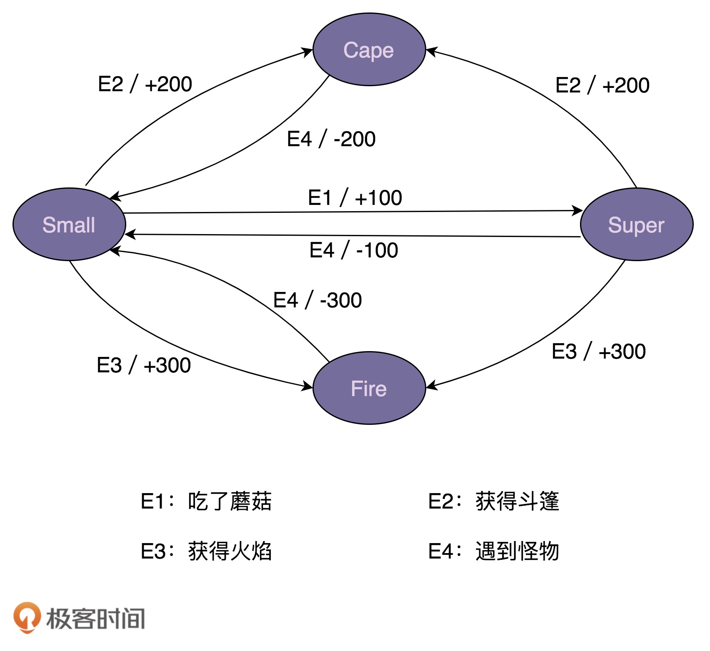
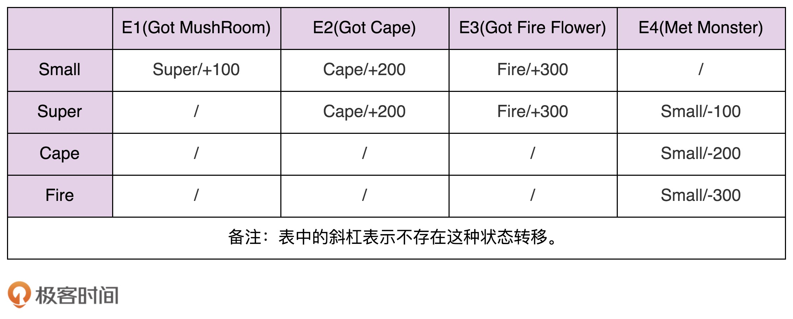

[toc]

## 64 | 状态模式：游戏、工作流引擎中常用的状态机是如何实现的？

### 什么是有限状态机？

-   有限状态机（FSM），简称为状态机。

-   状态机有 3 个组成部分：

    -   状态（State）
    -   事件（Event）
    -   动作（Action）

-   其中，事件也称为转移条件（Transition Condition）。事件触发状态的转移及动作的执行。不过，动作不是必须的，也可以只转移状态，不执行任何动作。

-   “超级马里奥”中的状态和事件，简化后的状态转移如下图：

    -   

-   如何实现上面的状态机？下面是一个骨架代码：

    -   ```java
        
        public enum State {
          SMALL(0),
          SUPER(1),
          FIRE(2),
          CAPE(3);
        
          private int value;
        
          private State(int value) {
            this.value = value;
          }
        
          public int getValue() {
            return this.value;
          }
        }
        
        public class MarioStateMachine {
          private int score;
          private State currentState;
        
          public MarioStateMachine() {
            this.score = 0;
            this.currentState = State.SMALL;
          }
        
          public void obtainMushRoom() {
            //TODO
          }
        
          public void obtainCape() {
            //TODO
          }
        
          public void obtainFireFlower() {
            //TODO
          }
        
          public void meetMonster() {
            //TODO
          }
        
          public int getScore() {
            return this.score;
          }
        
          public State getCurrentState() {
            return this.currentState;
          }
        }
        
        public class ApplicationDemo {
          public static void main(String[] args) {
            MarioStateMachine mario = new MarioStateMachine();
            mario.obtainMushRoom();
            int score = mario.getScore();
            State state = mario.getCurrentState();
            System.out.println("mario score: " + score + "; state: " + state);
          }
        }
        ```

    -   

### 实现方式一：分支逻辑法

-   参照状态转移图，将每一个状态转移，翻译成代码。

-   按这个思路，将上面的骨架代码补全一下：

    -   ```java
        
        public class MarioStateMachine {
          private int score;
          private State currentState;
        
          public MarioStateMachine() {
            this.score = 0;
            this.currentState = State.SMALL;
          }
        
          public void obtainMushRoom() {
            if (currentState.equals(State.SMALL)) {
              this.currentState = State.SUPER;
              this.score += 100;
            }
          }
        
          public void obtainCape() {
            if (currentState.equals(State.SMALL) || currentState.equals(State.SUPER) ) {
              this.currentState = State.CAPE;
              this.score += 200;
            }
          }
        
          public void obtainFireFlower() {
            if (currentState.equals(State.SMALL) || currentState.equals(State.SUPER) ) {
              this.currentState = State.FIRE;
              this.score += 300;
            }
          }
        
          public void meetMonster() {
            if (currentState.equals(State.SUPER)) {
              this.currentState = State.SMALL;
              this.score -= 100;
              return;
            }
        
            if (currentState.equals(State.CAPE)) {
              this.currentState = State.SMALL;
              this.score -= 200;
              return;
            }
        
            if (currentState.equals(State.FIRE)) {
              this.currentState = State.SMALL;
              this.score -= 300;
              return;
            }
          }
        
          public int getScore() {
            return this.score;
          }
        
          public State getCurrentState() {
            return this.currentState;
          }
        }
        ```

-   这种写法：可读性、可维护性都很差。

### 实现方式二：查表法

-    除了状态转移图，状态机还可以用二维表来表示，如下所示。这个二维表中，第一维表示当前状态，第二维表示事件，值表示当前状态经过事件后，转移到的新状态及其执行的动作。

-   

-   相对于分支逻辑的实现方式，查表法的代码实现更加清晰，可读性和可维护性更好。

-   具体代码如上所示：

    -   ```java
        
        public enum Event {
          GOT_MUSHROOM(0),
          GOT_CAPE(1),
          GOT_FIRE(2),
          MET_MONSTER(3);
        
          private int value;
        
          private Event(int value) {
            this.value = value;
          }
        
          public int getValue() {
            return this.value;
          }
        }
        
        public class MarioStateMachine {
          private int score;
          private State currentState;
        
          private static final State[][] transitionTable = {
                  {SUPER, CAPE, FIRE, SMALL},
                  {SUPER, CAPE, FIRE, SMALL},
                  {CAPE, CAPE, CAPE, SMALL},
                  {FIRE, FIRE, FIRE, SMALL}
          };
        
          private static final int[][] actionTable = {
                  {+100, +200, +300, +0},
                  {+0, +200, +300, -100},
                  {+0, +0, +0, -200},
                  {+0, +0, +0, -300}
          };
        
          public MarioStateMachine() {
            this.score = 0;
            this.currentState = State.SMALL;
          }
        
          public void obtainMushRoom() {
            executeEvent(Event.GOT_MUSHROOM);
          }
        
          public void obtainCape() {
            executeEvent(Event.GOT_CAPE);
          }
        
          public void obtainFireFlower() {
            executeEvent(Event.GOT_FIRE);
          }
        
          public void meetMonster() {
            executeEvent(Event.MET_MONSTER);
          }
        
          private void executeEvent(Event event) {
            int stateValue = currentState.getValue();
            int eventValue = event.getValue();
            this.currentState = transitionTable[stateValue][eventValue];
            this.score = actionTable[stateValue][eventValue];
          }
        
          public int getScore() {
            return this.score;
          }
        
          public State getCurrentState() {
            return this.currentState;
          }
        
        }
        ```

    -   

### 实现方式三：状态模式

-   **状态模式通过将事件触发的状态转移和动作执行，拆分到不同的状态类中，来避免分支判断逻辑**。

-   利用状态模式，我们来补全 MarioStateMachine 类，补全后代码如下所示：

    -   ```java
        
        public interface IMario { //所有状态类的接口
          State getName();
          //以下是定义的事件
          void obtainMushRoom();
          void obtainCape();
          void obtainFireFlower();
          void meetMonster();
        }
        
        public class SmallMario implements IMario {
          private MarioStateMachine stateMachine;
        
          public SmallMario(MarioStateMachine stateMachine) {
            this.stateMachine = stateMachine;
          }
        
          @Override
          public State getName() {
            return State.SMALL;
          }
        
          @Override
          public void obtainMushRoom() {
            stateMachine.setCurrentState(new SuperMario(stateMachine));
            stateMachine.setScore(stateMachine.getScore() + 100);
          }
        
          @Override
          public void obtainCape() {
            stateMachine.setCurrentState(new CapeMario(stateMachine));
            stateMachine.setScore(stateMachine.getScore() + 200);
          }
        
          @Override
          public void obtainFireFlower() {
            stateMachine.setCurrentState(new FireMario(stateMachine));
            stateMachine.setScore(stateMachine.getScore() + 300);
          }
        
          @Override
          public void meetMonster() {
            // do nothing...
          }
        }
        
        public class SuperMario implements IMario {
          private MarioStateMachine stateMachine;
        
          public SuperMario(MarioStateMachine stateMachine) {
            this.stateMachine = stateMachine;
          }
        
          @Override
          public State getName() {
            return State.SUPER;
          }
        
          @Override
          public void obtainMushRoom() {
            // do nothing...
          }
        
          @Override
          public void obtainCape() {
            stateMachine.setCurrentState(new CapeMario(stateMachine));
            stateMachine.setScore(stateMachine.getScore() + 200);
          }
        
          @Override
          public void obtainFireFlower() {
            stateMachine.setCurrentState(new FireMario(stateMachine));
            stateMachine.setScore(stateMachine.getScore() + 300);
          }
        
          @Override
          public void meetMonster() {
            stateMachine.setCurrentState(new SmallMario(stateMachine));
            stateMachine.setScore(stateMachine.getScore() - 100);
          }
        }
        
        // 省略CapeMario、FireMario类...
        
        public class MarioStateMachine {
          private int score;
          private IMario currentState; // 不再使用枚举来表示状态
        
          public MarioStateMachine() {
            this.score = 0;
            this.currentState = new SmallMario(this);
          }
        
          public void obtainMushRoom() {
            this.currentState.obtainMushRoom();
          }
        
          public void obtainCape() {
            this.currentState.obtainCape();
          }
        
          public void obtainFireFlower() {
            this.currentState.obtainFireFlower();
          }
        
          public void meetMonster() {
            this.currentState.meetMonster();
          }
        
          public int getScore() {
            return this.score;
          }
        
          public State getCurrentState() {
            return this.currentState.getName();
          }
        
          public void setScore(int score) {
            this.score = score;
          }
        
          public void setCurrentState(IMario currentState) {
            this.currentState = currentState;
          }
        }
        ```

-   上面的代码还可以继续优化。

    -   ```java
        
        public interface IMario {
          State getName();
          void obtainMushRoom(MarioStateMachine stateMachine);
          void obtainCape(MarioStateMachine stateMachine);
          void obtainFireFlower(MarioStateMachine stateMachine);
          void meetMonster(MarioStateMachine stateMachine);
        }
        
        public class SmallMario implements IMario {
          private static final SmallMario instance = new SmallMario();
          private SmallMario() {}
          public static SmallMario getInstance() {
            return instance;
          }
        
          @Override
          public State getName() {
            return State.SMALL;
          }
        
          @Override
          public void obtainMushRoom(MarioStateMachine stateMachine) {
            stateMachine.setCurrentState(SuperMario.getInstance());
            stateMachine.setScore(stateMachine.getScore() + 100);
          }
        
          @Override
          public void obtainCape(MarioStateMachine stateMachine) {
            stateMachine.setCurrentState(CapeMario.getInstance());
            stateMachine.setScore(stateMachine.getScore() + 200);
          }
        
          @Override
          public void obtainFireFlower(MarioStateMachine stateMachine) {
            stateMachine.setCurrentState(FireMario.getInstance());
            stateMachine.setScore(stateMachine.getScore() + 300);
          }
        
          @Override
          public void meetMonster(MarioStateMachine stateMachine) {
            // do nothing...
          }
        }
        
        // 省略SuperMario、CapeMario、FireMario类...
        
        public class MarioStateMachine {
          private int score;
          private IMario currentState;
        
          public MarioStateMachine() {
            this.score = 0;
            this.currentState = SmallMario.getInstance();
          }
        
          public void obtainMushRoom() {
            this.currentState.obtainMushRoom(this);
          }
        
          public void obtainCape() {
            this.currentState.obtainCape(this);
          }
        
          public void obtainFireFlower() {
            this.currentState.obtainFireFlower(this);
          }
        
          public void meetMonster() {
            this.currentState.meetMonster(this);
          }
        
          public int getScore() {
            return this.score;
          }
        
          public State getCurrentState() {
            return this.currentState.getName();
          }
        
          public void setScore(int score) {
            this.score = score;
          }
        
          public void setCurrentState(IMario currentState) {
            this.currentState = currentState;
          }
        }
        ```

-   实际上，像游戏这种比较复杂的状态机，包含的状态较多，我优先推荐使用查表法，而状态模式会引入非常多的状态类，会导致代码比较难维护。

-   像事件触发执行的动作包含的业务逻辑可能会比较复杂，所以，更加推荐使用状态模式来实现。

### 重点回顾

-   状态模式是状态机的一种实现方式。
-   状态机又叫有限状态机，它有 3 部分组成：状态、事件、动作。
-   针对状态，今天，我们总结了三种实现方式：
    1.  分支逻辑法。
    2.  查表法。
    3.  状态模式。

