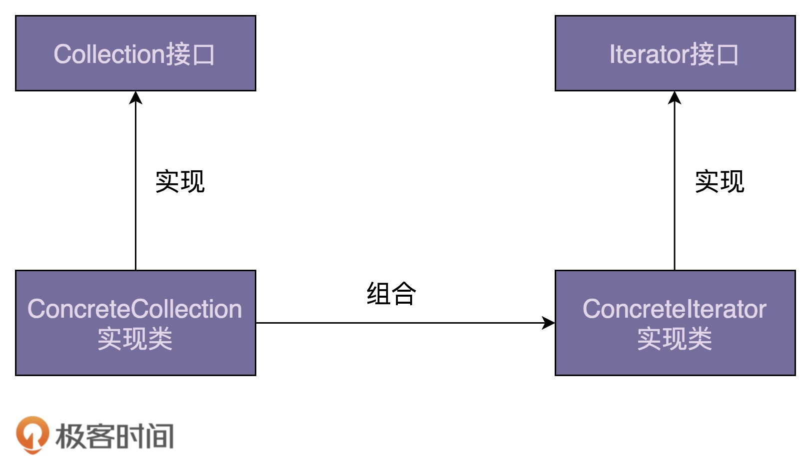
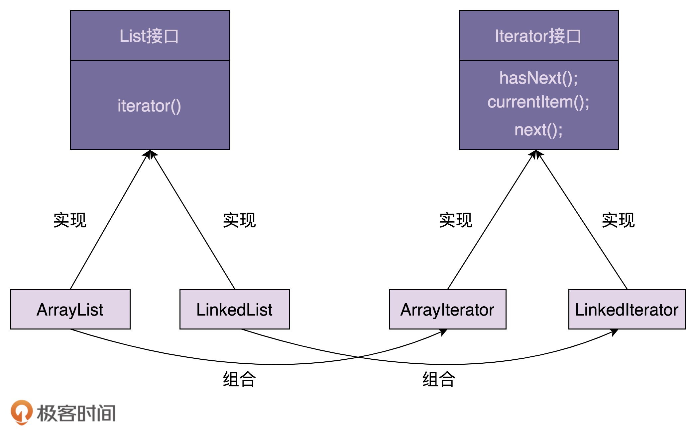

[toc]

## 65 | 迭代器模式（上）：相比直接遍历集合数据，使用迭代器有哪些优势？

### 迭代器模式的原理和实现

-   迭代器模式（游标模式），它**用来遍历集合对象**。这里说的“集合对象”也叫“容器”“聚合对象”，实际上就是包含一组对象的对象。迭代器模式将集合对象的遍历操作从集合中拆分出来，放到迭代器中，让两者职责更加单一。

-   一个简单的类图

    -   

-   Iterator 接口的定义，如下：

    -   ```java
        
        // 接口定义方式一
        public interface Iterator<E> {
          boolean hasNext();
          void next();
          E currentItem();
        }
        
        // 接口定义方式二
        public interface Iterator<E> {
          boolean hasNext();
          E next();
        }
        ```

-   ArrayIterator 代码实现，如下：

    -   ```java
        
        public class ArrayIterator<E> implements Iterator<E> {
          private int cursor;
          private ArrayList<E> arrayList;
        
          public ArrayIterator(ArrayList<E> arrayList) {
            this.cursor = 0;
            this.arrayList = arrayList;
          }
        
          @Override
          public boolean hasNext() {
            return cursor != arrayList.size(); //注意这里，cursor在指向最后一个元素的时候，hasNext()仍旧返回true。
          }
        
          @Override
          public void next() {
            cursor++;
          }
        
          @Override
          public E currentItem() {
            if (cursor >= arrayList.size()) {
              throw new NoSuchElementException();
            }
            return arrayList.get(cursor);
          }
        }
        
        public class Demo {
          public static void main(String[] args) {
            ArrayList<String> names = new ArrayList<>();
            names.add("xzg");
            names.add("wang");
            names.add("zheng");
            
            Iterator<String> iterator = new ArrayIterator(names);
            while (iterator.hasNext()) {
              System.out.println(iterator.currentItem());
              iterator.next();
            }
          }
        }
        ```

-   为了能实现基于接口而非实现编程，我们还需要将这个方法定义在 List 接口中。代码如下：

    -   ```java
        
        public interface List<E> {
          Iterator iterator();
          //...省略其他接口函数...
        }
        
        public class ArrayList<E> implements List<E> {
          //...
          public Iterator iterator() {
            return new ArrayIterator(this);
          }
          //...省略其他代码
        }
        
        public class Demo {
          public static void main(String[] args) {
            List<String> names = new ArrayList<>();
            names.add("xzg");
            names.add("wang");
            names.add("zheng");
            
            Iterator<String> iterator = names.iterator();
            while (iterator.hasNext()) {
              System.out.println(iterator.currentItem());
              iterator.next();
            }
          }
        }
        ```

-   迭代器的**设计思路**：

    -   迭代器中需要定义 hasNext()、currentItem()、next() 三个最基本的方法。
    -   待遍历的容器对象通过依赖注入传递到迭代器类中。
    -   容器通过 iterator() 方法来创建迭代器。

-   较细化的类图，如下：

    -   

### 迭代器模式的优势

-   从代码上来看，for循环遍历方式比起迭代器遍历方式，代码看起来更加简洁。那我们为什么还要用迭代器来遍历容器呢？为什么还要给容器设计对应的迭代器呢？原因有以下三个：
    1.  对于类似数组和链表这样的数据结构，遍历方式比较简单，直接使用 for 循环来遍历就足够了。对于复杂的数据结构（树、图）来说，有各种复杂的遍历方式。如果将这部分遍历的逻辑写到容器类中，也会导致容器类代码的复杂性。
    2.  应对复杂性的方法就是拆分，我们可以将遍历操作拆分到迭代器类中。
    3.  容器和迭代器都提供了抽象的接口，方便我们在开发的时候，基于接口而非具体的实现编程。

### 重点回顾

-   迭代器模式，也叫游标模式。它用来遍历集合对象。这里说的“集合对象”，我们也可以叫“容器”“聚合对象”，实际上就是包含一组对象的对象。
-   一个完整的迭代器模式，一般会涉及容器和容器迭代器两部分内容。
-   为了达到基于接口而非实现编程的目的，容器又包含容器接口、容器实现类，迭代器又包含迭代器接口、迭代器实现类。
-   容器中需要定义 iterator() 方法，用来创建迭代器。迭代器中需要定义 hasNext()、currentItem()、next() 三个最基本的方法。容器对象通过依赖注入传递到迭代器类中。
-   遍历集合一般有三种方式：for、foreach、迭代器遍历。后两者都可以看作迭代器遍历。相对于 for 循环遍历，迭代器遍历有下面三个优势：
    -   迭代器模式封装集合内部的复杂数据结构。
    -   迭代器模式将集合对象的遍历操作从集合类中拆分出来，放到迭代器类中，让两者的职责更加单一。
    -   迭代器模式让添加新的遍历算法更加容易，更符合开闭原则。此外，因为迭代器都实现自相同 的接口，在开发中，基于接口而非实现编程，替换迭代器也变得更加容易。