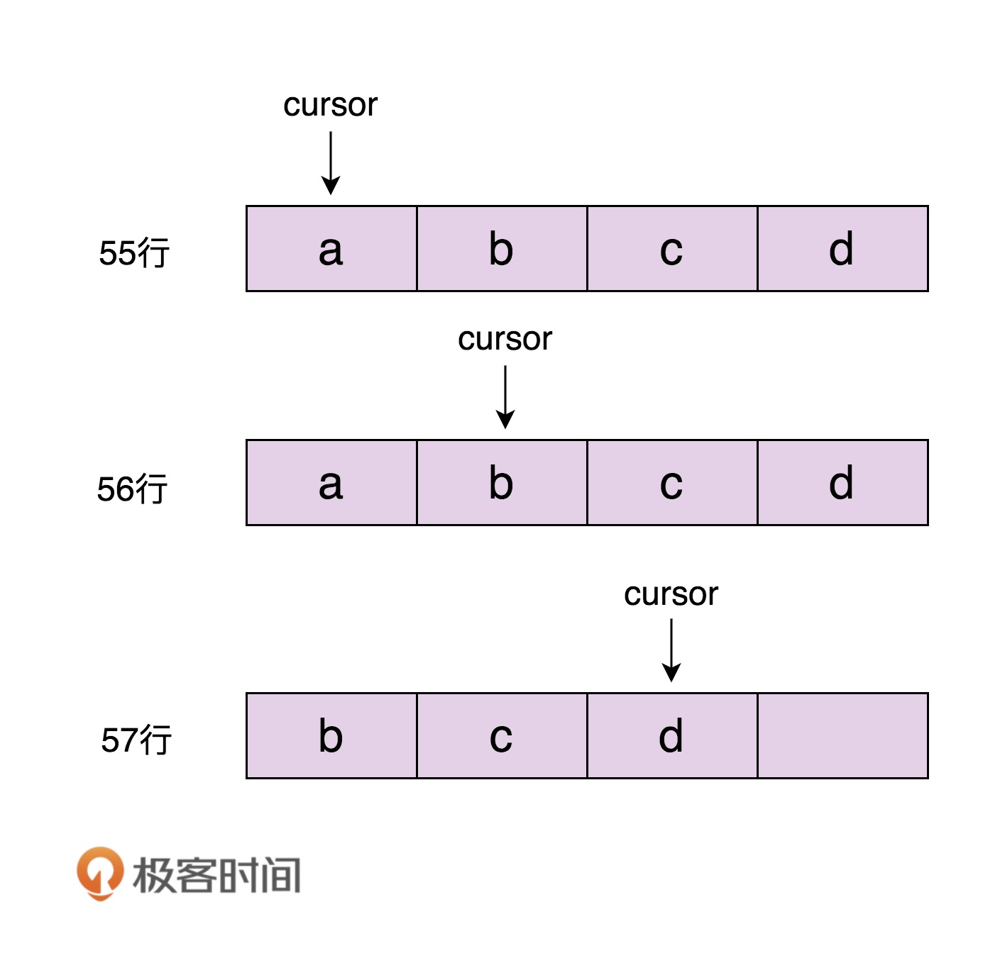
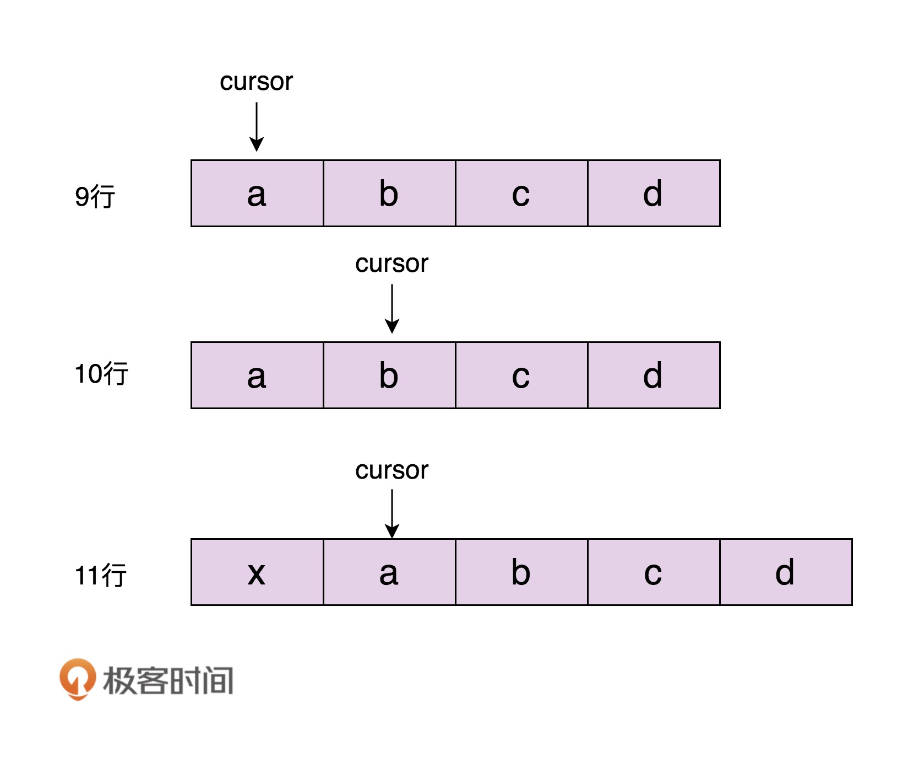

[toc]

## 66 | 迭代器模式（中）：遍历集合的同时，为什么不能增删集合元素？

### 在遍历的同时增删集合元素，会发生什么？

-   通过迭代器来遍历集合元素的同时，增加或删除集合中的元素，有可能导致某个元素被重复遍历或遍历不到。有时也可以正常遍历。这种行为称为**结果不可预期行为**或**未决行为**。

-   **删除**示例代码：

    -   ```java
        
        public interface Iterator<E> {
          boolean hasNext();
          void next();
          E currentItem();
        }
        
        public class ArrayIterator<E> implements Iterator<E> {
          private int cursor;
          private ArrayList<E> arrayList;
        
          public ArrayIterator(ArrayList<E> arrayList) {
            this.cursor = 0;
            this.arrayList = arrayList;
          }
        
          @Override
          public boolean hasNext() {
            return cursor < arrayList.size();
          }
        
          @Override
          public void next() {
            cursor++;
          }
        
          @Override
          public E currentItem() {
            if (cursor >= arrayList.size()) {
              throw new NoSuchElementException();
            }
            return arrayList.get(cursor);
          }
        }
        
        public interface List<E> {
          Iterator iterator();
        }
        
        public class ArrayList<E> implements List<E> {
          //...
          public Iterator iterator() {
            return new ArrayIterator(this);
          }
          //...
        }
        
        public class Demo {
          public static void main(String[] args) {
            List<String> names = new ArrayList<>();
            names.add("a");
            names.add("b");
            names.add("c");
            names.add("d");
        
            Iterator<String> iterator = names.iterator();
            iterator.next();
            names.remove("a");
          }
        }
        ```

    -   

-   **添加**示例代码：

    -   ```java
        
        public class Demo {
          public static void main(String[] args) {
            List<String> names = new ArrayList<>();
            names.add("a");
            names.add("b");
            names.add("c");
            names.add("d");
        
            Iterator<String> iterator = names.iterator();
            iterator.next();
            names.add(0, "x");
          }
        }
        ```

    -   

### 如何应对遍历时改变集合导致的未决行为？

-   比较干脆利索的解决方案：

    1.  一种是遍历的时候不允许增删元素。

    2.  另一种是增删元素之后让遍历报错。

-   第一种方法比较难实现，我们要确定遍历开始和结束时间点。

-   第二种解决方法更加合理。Java 语言就是采用这种解决方案的。

    -   ArrayList 中定义一个成员变量 modCount，记录集合被修改的次数，集合每调用一次增加或删除元素函数，就会给 modCount 加 1。
    -   当通过调用集合上的 iterator() 函数来创建迭代器的时候，我们把 modCount 值传递给迭代器的 expectedModCount 变量。之后，每次调用迭代器上的 hasNext()、next()、currentItem() 函数，我们都会检查集合上的 modCount 是否等于 expectedModCount，也就是看，**在创建完迭代器后，modCount 是否改变过**。
    -   我们选择 fail-fast 解决方式，及时抛出异常。

-   示例代码如下：

    -   ```java
        
        public class ArrayIterator implements Iterator {
          private int cursor;
          private ArrayList arrayList;
          private int expectedModCount;
        
          public ArrayIterator(ArrayList arrayList) {
            this.cursor = 0;
            this.arrayList = arrayList;
            this.expectedModCount = arrayList.modCount;
          }
        
          @Override
          public boolean hasNext() {
            checkForComodification();
            return cursor < arrayList.size();
          }
        
          @Override
          public void next() {
            checkForComodification();
            cursor++;
          }
        
          @Override
          public Object currentItem() {
            checkForComodification();
            return arrayList.get(cursor);
          }
          
          private void checkForComodification() {
            if (arrayList.modCount != expectedModCount)
                throw new ConcurrentModificationException();
          }
        }
        
        //代码示例
        public class Demo {
          public static void main(String[] args) {
            List<String> names = new ArrayList<>();
            names.add("a");
            names.add("b");
            names.add("c");
            names.add("d");
        
            Iterator<String> iterator = names.iterator();
            iterator.next();
            names.remove("a");
            iterator.next();//抛出ConcurrentModificationException异常
          }
        }
        ```

    -   

### 如何在遍历的同时安全地删除集合元素？

-   Java 语言，还定义了一个 remove() 方法，能够在遍历集合的同时，安全地删除集合中的元素。它只能删除游标指向的前一个元素，而且一个 next() 函数后，只能最多一个 remove() 操作。

    -   ```java
        
        public class Demo {
          public static void main(String[] args) {
            List<String> names = new ArrayList<>();
            names.add("a");
            names.add("b");
            names.add("c");
            names.add("d");
        
            Iterator<String> iterator = names.iterator();
            iterator.next();
            iterator.remove();
            iterator.remove(); //报错，抛出IllegalStateException异常
          }
        }
        ```

-   remove() 源码解析

    -   ```java
        
        public class ArrayList<E> {
          transient Object[] elementData;
          private int size;
        
          public Iterator<E> iterator() {
            return new Itr();
          }
        
          private class Itr implements Iterator<E> {
            int cursor;       // index of next element to return
            int lastRet = -1; // index of last element returned; -1 if no such
            int expectedModCount = modCount;
        
            Itr() {}
        
            public boolean hasNext() {
              return cursor != size;
            }
        
            @SuppressWarnings("unchecked")
            public E next() {
              checkForComodification();
              int i = cursor;
              if (i >= size)
                throw new NoSuchElementException();
              Object[] elementData = ArrayList.this.elementData;
              if (i >= elementData.length)
                throw new ConcurrentModificationException();
              cursor = i + 1;
              return (E) elementData[lastRet = i];
            }
            
            public void remove() {
              if (lastRet < 0)
                throw new IllegalStateException();
              checkForComodification();
        
              try {
                ArrayList.this.remove(lastRet);
                cursor = lastRet;
                lastRet = -1;
                expectedModCount = modCount;
              } catch (IndexOutOfBoundsException ex) {
                throw new ConcurrentModificationException();
              }
            }
          }
        }
        ```

    -   

### 重点回顾

-   通过迭代器来遍历集合元素的同时，增加或删除集合中的元素。会产生**结果不可预期**或**未决行为**。
-   有两种比较干脆利索的解决方案：
    1.  遍历时候不允许增删元素。
    2.  增删元素后让遍历报错。
-   第二种解决方案更加合理。Java 就是采用这种解决方案。增删元素后，我们选择 fail-fast 解决方式，让遍历操作直接抛出运行时异常。
-   Java 还定义一个 remove() 方法，能够在遍历集合的同时，安全地删除集合中元素。

