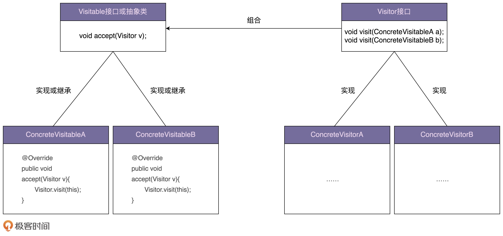

[toc]

## 68 | 访问者模式（上）：手把手带你还原访问者模式诞生的思维过程

### 带你“发明”访问者模式

-   我们抽象出来一个 **Visitor 接口**，包含是三个命名非常通用的 visit() 重载函数，分别处理三种不同类型的资源文件。具体做什么业务处理，由这个 Visitor 接口具体的类来决定，如 Extractor 负责抽取文件内容，Compressor 负责压缩。

-   当我们新添加一个业务功能的时候，资源文件类不需要做任何修改，只需要修改 ToolApplication 代码就可以了。

-   代码如下：

    -   ```java
        
        public abstract class ResourceFile {
          protected String filePath;
          public ResourceFile(String filePath) {
            this.filePath = filePath;
          }
          abstract public void accept(Visitor vistor);
        }
        
        public class PdfFile extends ResourceFile {
          public PdfFile(String filePath) {
            super(filePath);
          }
        
          @Override
          public void accept(Visitor visitor) {
            visitor.visit(this);
          }
        
          //...
        }
        //...PPTFile、WordFile跟PdfFile类似，这里就省略了...
        
        public interface Visitor {
          void visit(PdfFile pdfFile);
          void visit(PPTFile pdfFile);
          void visit(WordFile pdfFile);
        }
        
        public class Extractor implements Visitor {
          @Override
          public void visit(PPTFile pptFile) {
            //...
            System.out.println("Extract PPT.");
          }
        
          @Override
          public void visit(PdfFile pdfFile) {
            //...
            System.out.println("Extract PDF.");
          }
        
          @Override
          public void visit(WordFile wordFile) {
            //...
            System.out.println("Extract WORD.");
          }
        }
        
        public class Compressor implements Visitor {
          @Override
          public void visit(PPTFile pptFile) {
            //...
            System.out.println("Compress PPT.");
          }
        
          @Override
          public void visit(PdfFile pdfFile) {
            //...
            System.out.println("Compress PDF.");
          }
        
          @Override
          public void visit(WordFile wordFile) {
            //...
            System.out.println("Compress WORD.");
          }
        
        }
        
        public class ToolApplication {
          public static void main(String[] args) {
            Extractor extractor = new Extractor();
            List<ResourceFile> resourceFiles = listAllResourceFiles(args[0]);
            for (ResourceFile resourceFile : resourceFiles) {
              resourceFile.accept(extractor);
            }
        
            Compressor compressor = new Compressor();
            for(ResourceFile resourceFile : resourceFiles) {
              resourceFile.accept(compressor);
            }
          }
        
          private static List<ResourceFile> listAllResourceFiles(String resourceDirectory) {
            List<ResourceFile> resourceFiles = new ArrayList<>();
            //...根据后缀(pdf/ppt/word)由工厂方法创建不同的类对象(PdfFile/PPTFile/WordFile)
            resourceFiles.add(new PdfFile("a.pdf"));
            resourceFiles.add(new WordFile("b.word"));
            resourceFiles.add(new PPTFile("c.ppt"));
            return resourceFiles;
          }
        }
        ```

    -   

### 重新来看访问者模式

-   访问者模式，**允许一个或者多个操作应用到一组对象上，解耦操作和对象本身**。 -- GoF 《访问者模式》
-   类图：
    -   

### 重点回顾

-   访问者模式允许一个或多个操作应用到一组对象上，设计意图是解耦操作和对象本身，保持类职责单一、满足开闭原则以及应对代码的复杂性。
-   对于访问者模式，主要难点在于代码实现。
-   代码实现比较复杂的主要原因是，函数重载在大部分面向对象编程语言中是静态绑定的。也就是说，调用类的哪个重载函数，是在编译期间，由参数的声明类型决定的，而非运行时，根据参数的实际类型决定的。
-   建议，除非不得已，不要使用这种模式。

