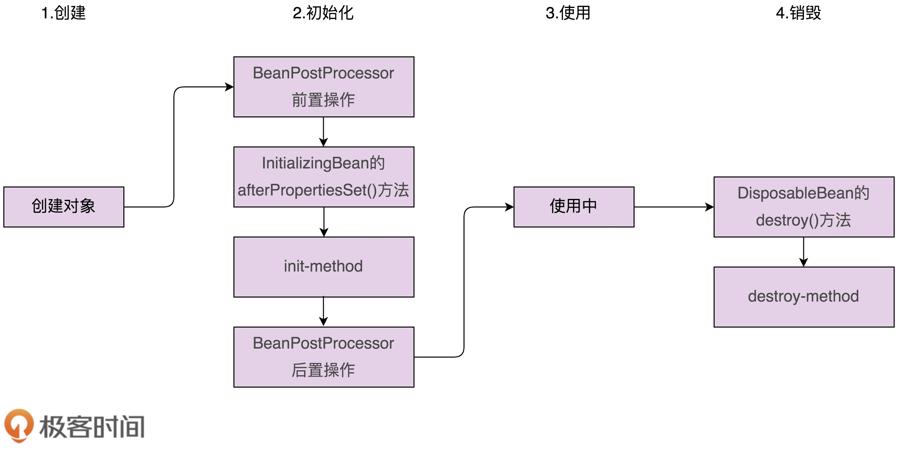

[toc]

## 85 | 开源实战四（中）：剖析 Spring 框架中用来支持扩展和两种设计模式

1.  **可扩展**，也是大部分框架应该具备的一个重要的特性。
2.  框架可扩展，意思就是，框架使用者在不修改框架源码的情况下，**基于扩展点定制扩展新的功能**。
3.  今天，我们剖析 Spring 框架为了支持可扩展特性用的 2 种设计模式：**观察者模式和模板模式**。

### 观察者模式在 Spring 中的应用

1.  Spring 中实现观察者模式包含三部分：Event 事件（消息）、Listener 监听者（观察者）、Publisher 发送者（被观察者）。

2.  Spring 中观察者模式使用：

    -   ```java
        
        // Event事件
        public class DemoEvent extends ApplicationEvent {
          private String message;
        
          public DemoEvent(Object source, String message) {
            super(source);
          }
        
          public String getMessage() {
            return this.message;
          }
        }
        
        // Listener监听者
        @Component
        public class DemoListener implements ApplicationListener<DemoEvent> {
          @Override
          public void onApplicationEvent(DemoEvent demoEvent) {
            String message = demoEvent.getMessage();
            System.out.println(message);
          }
        }
        
        // Publisher发送者
        @Component
        public class DemoPublisher {
          @Autowired
          private ApplicationContext applicationContext;
        
          public void publishEvent(DemoEvent demoEvent) {
            this.applicationContext.publishEvent(demoEvent);
          }
        }
        ```

3.  ApplicationEvent 和 ApplicationListener 最大的作用是**做类型标识**用：

    -   ```java
        
        public abstract class ApplicationEvent extends EventObject {
          private static final long serialVersionUID = 7099057708183571937L;
          private final long timestamp = System.currentTimeMillis();
        
          public ApplicationEvent(Object source) {
            super(source);
          }
        
          public final long getTimestamp() {
            return this.timestamp;
          }
        }
        
        public class EventObject implements java.io.Serializable {
            private static final long serialVersionUID = 5516075349620653480L;
            protected transient Object  source;
        
            public EventObject(Object source) {
                if (source == null)
                    throw new IllegalArgumentException("null source");
                this.source = source;
            }
        
            public Object getSource() {
                return source;
            }
        
            public String toString() {
                return getClass().getName() + "[source=" + source + "]";
            }
        }
        
        public interface ApplicationListener<E extends ApplicationEvent> extends EventListener {
          void onApplicationEvent(E var1);
        }
        ```

4.  在 Spring 实现中，观察者注册到了哪里？又是如何注册的呢？

    -   我们把观察者注册到了 ApplicationContext 对象中。

    -   源码摘抄如下：

    -   ```java
        
        public abstract class AbstractApplicationContext extends ... {
          private final Set<ApplicationListener<?>> applicationListeners;
          
          public AbstractApplicationContext() {
            this.applicationListeners = new LinkedHashSet();
            //...
          }
          
          public void publishEvent(ApplicationEvent event) {
            this.publishEvent(event, (ResolvableType)null);
          }
        
          public void publishEvent(Object event) {
            this.publishEvent(event, (ResolvableType)null);
          }
        
          protected void publishEvent(Object event, ResolvableType eventType) {
            //...
            Object applicationEvent;
            if (event instanceof ApplicationEvent) {
              applicationEvent = (ApplicationEvent)event;
            } else {
              applicationEvent = new PayloadApplicationEvent(this, event);
              if (eventType == null) {
                eventType = ((PayloadApplicationEvent)applicationEvent).getResolvableType();
              }
            }
        
            if (this.earlyApplicationEvents != null) {
              this.earlyApplicationEvents.add(applicationEvent);
            } else {
              this.getApplicationEventMulticaster().multicastEvent(
                    (ApplicationEvent)applicationEvent, eventType);
            }
        
            if (this.parent != null) {
              if (this.parent instanceof AbstractApplicationContext) {
                ((AbstractApplicationContext)this.parent).publishEvent(event, eventType);
              } else {
                this.parent.publishEvent(event);
              }
            }
          }
          
          public void addApplicationListener(ApplicationListener<?> listener) {
            Assert.notNull(listener, "ApplicationListener must not be null");
            if (this.applicationEventMulticaster != null) {
            this.applicationEventMulticaster.addApplicationListener(listener);
            } else {
              this.applicationListeners.add(listener);
            }  
          }
          
          public Collection<ApplicationListener<?>> getApplicationListeners() {
            return this.applicationListeners;
          }
          
          protected void registerListeners() {
            Iterator var1 = this.getApplicationListeners().iterator();
        
            while(var1.hasNext()) {
              ApplicationListener<?> listener = (ApplicationListener)var1.next();     this.getApplicationEventMulticaster().addApplicationListener(listener);
            }
        
            String[] listenerBeanNames = this.getBeanNamesForType(ApplicationListener.class, true, false);
            String[] var7 = listenerBeanNames;
            int var3 = listenerBeanNames.length;
        
            for(int var4 = 0; var4 < var3; ++var4) {
              String listenerBeanName = var7[var4];
              this.getApplicationEventMulticaster().addApplicationListenerBean(listenerBeanName);
            }
        
            Set<ApplicationEvent> earlyEventsToProcess = this.earlyApplicationEvents;
            this.earlyApplicationEvents = null;
            if (earlyEventsToProcess != null) {
              Iterator var9 = earlyEventsToProcess.iterator();
        
              while(var9.hasNext()) {
                ApplicationEvent earlyEvent = (ApplicationEvent)var9.next();
                this.getApplicationEventMulticaster().multicastEvent(earlyEvent);
              }
            }
          }
        }
        ```

5.  借助 Spring 提供的观察者模式的骨架代码，如果我们要在 Spring 下实现某个事件的发送和监听，只需要做很少的工作：定义事件、定义监听器、往 ApplicationContext 中发送事件就可以了。

### 模板模式在 Spring 中的应用

1.  利用模板模式，**Spring 能让用户定制 Bean 的创建过程**。
2.  Spring Bean 的创建过程，大致可以分为两大步：**对象的创建和对象的初始化**。
3.  Spring 针对对象的初始化过程，还将它拆分成了三个小步骤：**初始化前置操作、初始化、初始化后置操作**。
4.  Spring Bean 的整个生命周期（创建加销毁）
    -   

### 重点回顾

1.  今天，我讲到了 Spring 中用到的两种支持扩展的设计模式：**观察者模式和模板模式**。
2.  Spring 提供了观察者模式包含 **Event 事件、Listener 监听者、Publisher 发送者**三部分。
    -   事件发送到 ApplicationContext 中，然后，ApplicationContext 将消息发送给事先注册好的监听者。

3.  我们还讲了模板模式在 Spring 中的一个典型应用 -- Bean 的创建过程。
    -   Bean 的创建包含两大步骤：对象的创建和对象初始化。
    -   其中，对象初始化又可以分解为 3 个小的步骤：初始化前置操作、初始化、初始化后置操作。