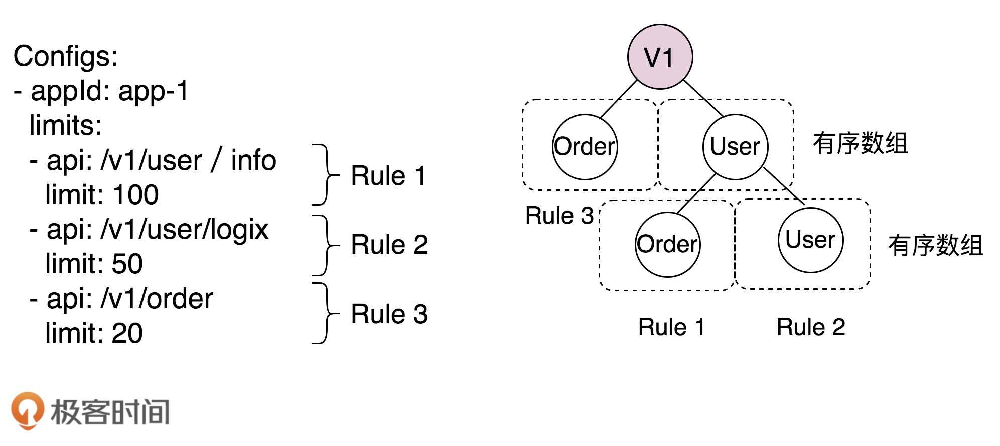

[toc]

## 92 | 项目实战一：设计实现一个支持各种算法的限流框架（实现）

1.  今天，我们针对限流架构的开发，如何做高质量的代码实现。

### V1 版本功能需求

1.  优秀的代码是重构出来的，复杂的代码是慢慢堆砌出来的。**小步快跑、逐步迭代**是我比较推崇的开发模式。我们可以先实现一个包含**核心功能、基本功能**的 V1 版本。
2.  下面，看看有些功能要放到 V1 版本中：
    -   **接口类型**，只支持 HTTP 接口的限流。
    -   **限流规则**，只支持本地文件配置，配置文件只支持 YAML。
    -   **限流算法**，只支持固定时间窗口算法。
    -   **限流模式**，只支持单机限流。
3.  考虑代码的**扩展性**，预留好扩展点。

### 最小原型代码

1.  面向对象设计与实现一般可以分为四个步骤：**划分职责识别类、定义属性和方法、定义类之间的交互关系、组装类并提供执行入口**。

2.  我的习惯是，先完全不考虑设计和代码质量，先把功能完成，先把基本的流程走通。然后，再针对 MVP（最小原型代码）做优化重构。

3.  **目录结构**

    -   ```bash
        com.xzg.ratelimiter
          --RateLimiter
        com.xzg.ratelimiter.rule
          --ApiLimit
          --RuleConfig
          --RateLimitRule
        com.xzg.ratelimiter.alg
          --RateLimitAlg
        ```

4.  **RateLimiter 类**

    -   RateLimiter 类用来串联整个限流流程。
    -   它先读取限流规则配置文件，映射为内存中的 Java 对象（RuleConfig），然后将这个中间结构构建成一个支持快速查询的数据结构（RateLimitRule）。
    -   此外，这个类还提供供用户直接使用最顶层接口（limit() 接口）。

    -   ```java
        
        public class RateLimiter {
          private static final Logger log = LoggerFactory.getLogger(RateLimiter.class);
          // 为每个api在内存中存储限流计数器
          private ConcurrentHashMap<String, RateLimitAlg> counters = new ConcurrentHashMap<>();
          private RateLimitRule rule;
        
          public RateLimiter() {
            // 将限流规则配置文件ratelimiter-rule.yaml中的内容读取到RuleConfig中
            InputStream in = null;
            RuleConfig ruleConfig = null;
            try {
              in = this.getClass().getResourceAsStream("/ratelimiter-rule.yaml");
              if (in != null) {
                Yaml yaml = new Yaml();
                ruleConfig = yaml.loadAs(in, RuleConfig.class);
              }
            } finally {
              if (in != null) {
                try {
                  in.close();
                } catch (IOException e) {
                  log.error("close file error:{}", e);
                }
              }
            }
        
            // 将限流规则构建成支持快速查找的数据结构RateLimitRule
            this.rule = new RateLimitRule(ruleConfig);
          }
        
          public boolean limit(String appId, String url) throws InternalErrorException {
            ApiLimit apiLimit = rule.getLimit(appId, url);
            if (apiLimit == null) {
              return true;
            }
        
            // 获取api对应在内存中的限流计数器（rateLimitCounter）
            String counterKey = appId + ":" + apiLimit.getApi();
            RateLimitAlg rateLimitCounter = counters.get(counterKey);
            if (rateLimitCounter == null) {
              RateLimitAlg newRateLimitCounter = new RateLimitAlg(apiLimit.getLimit());
              rateLimitCounter = counters.putIfAbsent(counterKey, newRateLimitCounter);
              if (rateLimitCounter == null) {
                rateLimitCounter = newRateLimitCounter;
              }
            }
        
            // 判断是否限流
            return rateLimitCounter.tryAcquire();
          }
        }
        ```

5.  **RuleConfig 和 ApiLimit 两个类**。

    -   ```java
        
        public class RuleConfig {
          private List<UniformRuleConfig> configs;
        
          public List<AppRuleConfig> getConfigs() {
            return configs;
          }
        
          public void setConfigs(List<AppRuleConfig> configs) {
            this.configs = configs;
          }
        
          public static class AppRuleConfig {
            private String appId;
            private List<ApiLimit> limits;
        
            public AppRuleConfig() {}
        
            public AppRuleConfig(String appId, List<ApiLimit> limits) {
              this.appId = appId;
              this.limits = limits;
            }
            //...省略getter、setter方法...
          }
        }
        
        public class ApiLimit {
          private static final int DEFAULT_TIME_UNIT = 1; // 1 second
          private String api;
          private int limit;
          private int unit = DEFAULT_TIME_UNIT;
        
          public ApiLimit() {}
        
          public ApiLimit(String api, int limit) {
            this(api, limit, DEFAULT_TIME_UNIT);
          }
        
          public ApiLimit(String api, int limit, int unit) {
            this.api = api;
            this.limit = limit;
            this.unit = unit;
          }
          // ...省略getter、setter方法...
        }
        ```

    -   ```yaml
        
        configs:          <!--对应RuleConfig-->
        - appId: app-1    <!--对应AppRuleConfig-->
          limits:
          - api: /v1/user <!--对应ApiLimit-->
            limit: 100
            unit：60
          - api: /v1/order
            limit: 50
        - appId: app-2
          limits:
          - api: /v1/user
            limit: 50
          - api: /v1/order
            limit: 50
        ```

6.  **RateLimitRule 类**

    -   为了尽可能地提高查询速度，我们需要将限流规则组织成一种支持按照 URL 快速查询的数据结构。

    -   

    -   ```java
        
        public class RateLimitRule {
          public RateLimitRule(RuleConfig ruleConfig) {
            //...
          }
        
          public ApiLimit getLimit(String appId, String api) {
            //...
          }
        }
        ```

7.  **RateLimitAlg 类**

    -   限流算法实现类。它实现了最简单的固定时间窗口限流算法。

    -   ```java
        
        public class RateLimitAlg {
          /* timeout for {@code Lock.tryLock() }. */
          private static final long TRY_LOCK_TIMEOUT = 200L;  // 200ms.
          private Stopwatch stopwatch;
          private AtomicInteger currentCount = new AtomicInteger(0);
          private final int limit;
          private Lock lock = new ReentrantLock();
        
          public RateLimitAlg(int limit) {
            this(limit, Stopwatch.createStarted());
          }
        
          @VisibleForTesting
          protected RateLimitAlg(int limit, Stopwatch stopwatch) {
            this.limit = limit;
            this.stopwatch = stopwatch;
          }
        
          public boolean tryAcquire() throws InternalErrorException {
            int updatedCount = currentCount.incrementAndGet();
            if (updatedCount <= limit) {
              return true;
            }
        
            try {
              if (lock.tryLock(TRY_LOCK_TIMEOUT, TimeUnit.MILLISECONDS)) {
                try {
                  if (stopwatch.elapsed(TimeUnit.MILLISECONDS) > TimeUnit.SECONDS.toMillis(1)) {
                    currentCount.set(0);
                    stopwatch.reset();
                  }
                  updatedCount = currentCount.incrementAndGet();
                  return updatedCount <= limit;
                } finally {
                  lock.unlock();
                }
              } else {
                throw new InternalErrorException("tryAcquire() wait lock too long:" + TRY_LOCK_TIMEOUT + "ms");
              }
            } catch (InterruptedException e) {
              throw new InternalErrorException("tryAcquire() is interrupted by lock-time-out.", e);
            }
          }
        }
        ```

    -   

### Review 最小原型代码

-   我们现在来分析一下这段代码的设计和实现。

#### 可读性

1.  我们重点关注**目录设计是否合理、模块划分是否清晰、代码结构是否高内聚低耦合，以及是否符合统一的编码规范**这几点。

### 扩展性

1.  代码的**扩展性**是我们最关注的。编写可扩展代码，关键是要建立**扩展意识**。
2.  具体到上面代码，不易扩展的最大原因是，没有遵循基于接口而非实现编程的编程思想，没有接口抽象意识。

### 重构最小原型代码

1.  上面代码的问题主要在于可扩展性。主要修改点有两个，

    -   一个是将 RateLimiter 中规则配置文件的读取解析逻辑拆出来，设计成独立的类。
    -   另一个是参照基于接口而非实现编程思想，对于 RateLimitRule、RateLimitAlg 类提炼抽象接口。

2.  重构后的目录结构

    -   ```bash
        
        // 重构前：
        com.xzg.ratelimiter
          --RateLimiter
        com.xzg.ratelimiter.rule
          --ApiLimit
          --RuleConfig
          --RateLimitRule
        com.xzg.ratelimiter.alg
          --RateLimitAlg
          
        // 重构后：
        com.xzg.ratelimiter
          --RateLimiter(有所修改)
        com.xzg.ratelimiter.rule
          --ApiLimit(不变)
          --RuleConfig(不变)
          --RateLimitRule(抽象接口)
          --TrieRateLimitRule(实现类，就是重构前的RateLimitRule）
        com.xzg.ratelimiter.rule.parser
          --RuleConfigParser(抽象接口)
          --YamlRuleConfigParser(Yaml格式配置文件解析类)
          --JsonRuleConfigParser(Json格式配置文件解析类)
        com.xzg.ratelimiter.rule.datasource
          --RuleConfigSource(抽象接口)
          --FileRuleConfigSource(基于本地文件的配置类)
        com.xzg.ratelimiter.alg
          --RateLimitAlg(抽象接口)
          --FixedTimeWinRateLimitAlg(实现类，就是重构前的RateLimitAlg)
        ```

3.  重构 RateLimiter 类

    -   ```java
        
        public class RateLimiter {
          private static final Logger log = LoggerFactory.getLogger(RateLimiter.class);
          // 为每个api在内存中存储限流计数器
          private ConcurrentHashMap<String, RateLimitAlg> counters = new ConcurrentHashMap<>();
          private RateLimitRule rule;
        
          public RateLimiter() {
            //改动主要在这里：调用RuleConfigSource类来实现配置加载
            RuleConfigSource configSource = new FileRuleConfigSource();
            RuleConfig ruleConfig = configSource.load();
            this.rule = new TrieRateLimitRule(ruleConfig);
          }
        
          public boolean limit(String appId, String url) throws InternalErrorException, InvalidUrlException {
            //...代码不变...
          }
        }
        ```

4.  RateLimiter 中拆分出来的限流规则加载的逻辑

    -   ```java
        
        com.xzg.ratelimiter.rule.parser
          --RuleConfigParser(抽象接口)
          --YamlRuleConfigParser(Yaml格式配置文件解析类)
          --JsonRuleConfigParser(Json格式配置文件解析类)
        com.xzg.ratelimiter.rule.datasource
          --RuleConfigSource(抽象接口)
          --FileRuleConfigSource(基于本地文件的配置类)
          
        public interface RuleConfigParser {
          RuleConfig parse(String configText);
          RuleConfig parse(InputStream in);
        }
        
        public interface RuleConfigSource {
          RuleConfig load();
        }
        
        public class FileRuleConfigSource implements RuleConfigSource {
          private static final Logger log = LoggerFactory.getLogger(FileRuleConfigSource.class);
        
          public static final String API_LIMIT_CONFIG_NAME = "ratelimiter-rule";
          public static final String YAML_EXTENSION = "yaml";
          public static final String YML_EXTENSION = "yml";
          public static final String JSON_EXTENSION = "json";
        
          private static final String[] SUPPORT_EXTENSIONS =
              new String[] {YAML_EXTENSION, YML_EXTENSION, JSON_EXTENSION};
          private static final Map<String, RuleConfigParser> PARSER_MAP = new HashMap<>();
        
          static {
            PARSER_MAP.put(YAML_EXTENSION, new YamlRuleConfigParser());
            PARSER_MAP.put(YML_EXTENSION, new YamlRuleConfigParser());
            PARSER_MAP.put(JSON_EXTENSION, new JsonRuleConfigParser());
          }
        
          @Override
          public RuleConfig load() {
            for (String extension : SUPPORT_EXTENSIONS) {
              InputStream in = null;
              try {
                in = this.getClass().getResourceAsStream("/" + getFileNameByExt(extension));
                if (in != null) {
                  RuleConfigParser parser = PARSER_MAP.get(extension);
                  return parser.parse(in);
                }
              } finally {
                if (in != null) {
                  try {
                    in.close();
                  } catch (IOException e) {
                    log.error("close file error:{}", e);
                  }
                }
              }
            }
            return null;
          }
        
          private String getFileNameByExt(String extension) {
            return API_LIMIT_CONFIG_NAME + "." + extension;
          }
        }
        ```

    -   

### 重点回顾

1.  优秀的代码是重构出来的，复杂的代码是慢慢堆砌出来的。小步快跑、逐步迭代是我比较推崇的开发模式。
    -   一方面，我们可以规划多个小版本来开发，不断迭代优化。
    -   另一方面，在编程实现的过程中，我们可以先实现 MVP 代码，以此来优化重构。
2.  如何对 MVP 代码优化重构呢？
    -   站在 Code Reviewer 的角度，结合经典的设计思想和原则，以及编码规范，从代码质量评判标准的角度，针对性地去优化不足。

